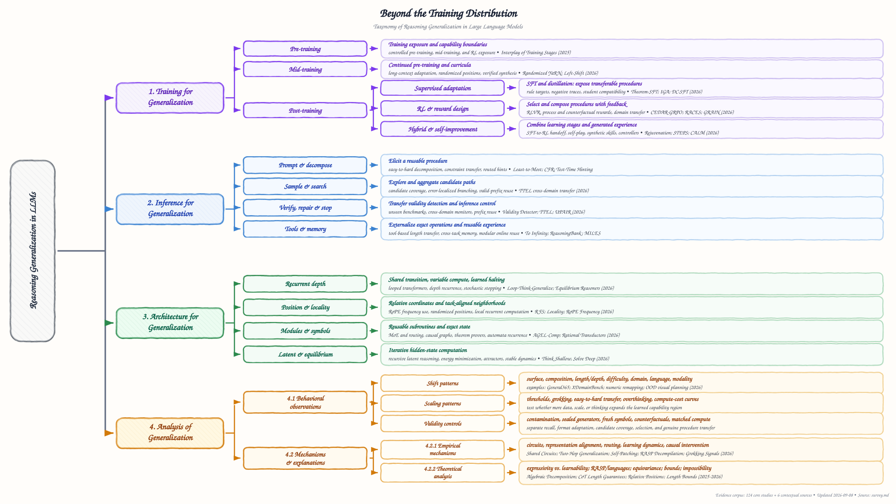

<div align="center">

# Awesome Reasoning Generalization

### Beyond the Training Distribution: A Survey of Reasoning Generalization in Large Language Models

[](https://awesome.re)


[](https://github.com/tue09/awesome-reasoning-generalization/commits/main)

</div>

> **Status:** The literature search was updated on 8 September 2026. The corpus contains 124 core studies, including 86 first posted in 2026.

## Contents

- [Taxonomy](#taxonomy)
- [Paper list](#paper-list)
  - [Training for Generalization](#training-for-generalization)
    - [Pre-training and mid-training](#pre-training-and-mid-training)
    - [Post-training: supervised adaptation](#post-training-supervised-adaptation)
    - [Post-training: RL and reward design](#post-training-rl-and-reward-design)
    - [Post-training: hybrid and self-improvement](#post-training-hybrid-and-self-improvement)
  - [Inference for Generalization](#inference-for-generalization)
    - [Prompt elicitation and decomposition](#prompt-elicitation-and-decomposition)
    - [Sampling and search](#sampling-and-search)
    - [Verification, repair, and stopping](#verification-repair-and-stopping)
    - [Tools and memory](#tools-and-memory)
  - [Architecture for Generalization](#architecture-for-generalization)
    - [Recurrent depth and adaptive computation](#recurrent-depth-and-adaptive-computation)
    - [Position, attention, and locality](#position-attention-and-locality)
    - [Modules, symbols, and structured state](#modules-symbols-and-structured-state)
    - [Latent recurrence and equilibrium computation](#latent-recurrence-and-equilibrium-computation)
  - [Analysis of Generalization](#analysis-of-generalization)
    - [Behavioral observations](#behavioral-observations)
    - [Empirical mechanisms and explanations](#empirical-mechanisms-and-explanations)
    - [Theoretical analysis](#theoretical-analysis)
- [Citation](#citation)

## Taxonomy

| Pillar | Central question |
| --- | --- |
| **Training for Generalization** | How can learning produce reasoning skills that transfer to unfamiliar problems? |
| **Inference for Generalization** | How can a fixed model solve unfamiliar problems through changes at inference? |
| **Architecture for Generalization** | Which structural properties support transferable reasoning? |
| **Analysis of Generalization** | When does reasoning generalize, and what explains its successes and failures? |

<p align="center">
  <a href="main_taxonomy.pdf"></a>
</p>

The first three pillars concern interventions. The fourth separates behavioral observations from empirical mechanisms and theoretical results. Each paper receives one primary manifest label, even when it informs several sections.

## Paper list

### Training for Generalization (38)

#### Pre-training and mid-training (8)

- **What You Can't See Is What You Learn: Slot-Selective Evidence Masking Favors Compositional Generalization in Shared-Genome Language-Model Societies**. *Narcis Marincat*. [[paper](https://arxiv.org/abs/2608.20054)] [[pdf](https://arxiv.org/pdf/2608.20054)], 2026-08.
- **Selective Left-Shift: Turning Test-Time Compute and Difficulty-based Curation into Training Data for Low-Resource Code Generation**. *Didula Samaraweera, Anjana Supun, Srinath Perera*. [[paper](https://arxiv.org/abs/2607.07748)] [[pdf](https://arxiv.org/pdf/2607.07748)], 2026-07.
- **Randomized YaRN Improves Length Generalization for Long-Context Reasoning**. *Manas Mehta, Fangcong Yin, Greg Durrett*. [[paper](https://arxiv.org/abs/2606.23687)] [[pdf](https://arxiv.org/pdf/2606.23687)], 2026-06.
- **Rethinking Easy-to-Hard: Limits of Curriculum Learning in Post-Training for Deductive Reasoning**. *Maximilian Mordig, Andreas Opedal, Weiyang Liu, Bernhard Schölkopf*. [[paper](https://arxiv.org/abs/2603.27226)] [[pdf](https://arxiv.org/pdf/2603.27226)], 2026-03.
- **Learning from Synthetic Data Improves Multi-hop Reasoning**. *Anmol Kabra, Yilun Yin, Albert Gong, Kamilė Stankevičiūtė, Dongyoung Go, Johann Lee, Katie Z. Luo, Carla P. Gomes, Kilian Q. Weinberger*. [[paper](https://arxiv.org/abs/2603.02091)] [[pdf](https://arxiv.org/pdf/2603.02091)], 2026-03.
- **Fundamental Reasoning Paradigms Induce Out-of-Domain Generalization in Language Models**. *Mingzi Cao, Xingwei Tan, Mahmud Elahi Akhter, Marco Valentino, Maria Liakata, Xi Wang, Nikolaos Aletras*. [[paper](https://arxiv.org/abs/2602.08658)] [[pdf](https://arxiv.org/pdf/2602.08658)], 2026-02.
- **Beyond Single-Task: Robust Multi-Task Length Generalization for LLMs**. *Yi Hu, Shijia Kang, Haotong Yang, Haotian Xu, Muhan Zhang*. [[paper](https://arxiv.org/abs/2502.11525)] [[pdf](https://arxiv.org/pdf/2502.11525)], 2025-02.
- **Complexity Control Facilitates Reasoning-Based Compositional Generalization in Transformers**. *Zhongwang Zhang, Pengxiao Lin, Zhiwei Wang, Yaoyu Zhang, Zhi-Qin John Xu*. [[paper](https://arxiv.org/abs/2501.08537)] [[pdf](https://arxiv.org/pdf/2501.08537)], 2025-01.

#### Post-training: supervised adaptation (9)

- **Every Coin Has Two Sides: On the Dual Nature of Generalization in On-Policy Distillation of Large Language Models**. *Zhaoyi Li, Deyang Kong, Yuan Wei, Evan Yang, Ranran Shen, Mahardika Krisna Ihsani, Ming Yang, Wei Zhang, Chuan Hao, Jian Yang, Ran Tao, Bryan Dai, Shikun Zhang, Wei Ye, Ying Wei, Defu Lian*. [[paper](https://arxiv.org/abs/2608.16647)] [[pdf](https://arxiv.org/pdf/2608.16647)], 2026-08.
- **RP-OPSD: Reasoning-Pivot-Guided On-Policy Self-Distillation for Multilingual Reasoning Transfer**. *Xinye Wang, Junxiao Liu, Shujian Huang*. [[paper](https://arxiv.org/abs/2608.06347)] [[pdf](https://arxiv.org/pdf/2608.06347)], 2026-08.
- **Geometric Self-Distillation for Reasoning Generalization**. *Josip Jukić, Ivan Titov*. [[paper](https://arxiv.org/abs/2607.06855)] [[pdf](https://arxiv.org/pdf/2607.06855)], 2026-07.
- **Invariant Gradient Alignment for Robust Reasoning Distillation**. *Zehua Cheng, Wei Dai, Jiahao Sun*. [[paper](https://arxiv.org/abs/2606.05025)] [[pdf](https://arxiv.org/pdf/2606.05025)], 2026-06.
- **Learning to Adapt SFT Data for Better Reasoning Generalization**. *Lisong Sun, Li Wang, Chen Zhang, Jinyang Wu, Kui Zhang, Tianhao Peng, Wenjun Wu*. [[paper](https://arxiv.org/abs/2605.26924)] [[pdf](https://arxiv.org/pdf/2605.26924)], 2026-05.
- **Memorize Theorems, Not Instances: Probing SFT Generalization through Mathematical Reasoning**. *Ruiying Peng, Mengyu Yang, Jing Lei, Xiaohui Li, Xueyu Wu, Xinlei Chen*. [[paper](https://arxiv.org/abs/2605.09270)] [[pdf](https://arxiv.org/pdf/2605.09270)], 2026-05.
- **Making Expert Reasoning Learnable with Self-Distillation**. *Ethan Mendes, Jungsoo Park, Alan Ritter*. [[paper](https://arxiv.org/abs/2602.02405)] [[pdf](https://arxiv.org/pdf/2602.02405)], 2026-02.
- **Learning from Mistakes: Negative Reasoning Samples Enhance Out-of-Domain Generalization**. *Xueyun Tian, Minghua Ma, Bingbing Xu, Nuoyan Lyu, Wei Li, Heng Dong, Zheng Chu, Yuanzhuo Wang, Huawei Shen*. [[paper](https://arxiv.org/abs/2601.04992)] [[pdf](https://arxiv.org/pdf/2601.04992)], 2026-01.
- **Mitigating Spurious Correlations in LLMs via Causality-Aware Post-Training**. *Shurui Gui, Shuiwang Ji*. [[paper](https://arxiv.org/abs/2506.09433)] [[pdf](https://arxiv.org/pdf/2506.09433)], 2025-06.

#### Post-training: RL and reward design (14)

- **GRAIN: Bridging Name and Narrative Shifts in Real-World Graph Reasoning through Invariance-Rewarded Agentic RL**. *Zike Yuan, Han Zhang, Jianzhi Yan, Le Liu, Cai Ke, Huozhi Zhou, Jian Xie, Jiran Yin, Yukun Cao, Yue Yu, Hui Wang, Ming Liu, Bing Qin*. [[paper](https://arxiv.org/abs/2608.27142)] [[pdf](https://arxiv.org/pdf/2608.27142)], 2026-08.
- **CEDAR-GRPO: Process-Aware Reinforcement Learning for General Abductive Reasoning in LLMs**. *Moein Salimi, Danial Parnian, Shaygan Adim, Amirmohammad Ebrahiminasab, Nima Alighardashi, Parsa Gholami, Sahand Akramipour, Mahdi Jafari Siavoshani, Mohammad Hossein Rohban*. [[paper](https://arxiv.org/abs/2608.14791)] [[pdf](https://arxiv.org/pdf/2608.14791)], 2026-08.
- **Transferability for General Reasoning: An Automated Curriculum for Multi-Domain RLVR**. *Yongjin Yang, Jiarui Liu, Yinghui He, Lechen Zhang, Bernhard Schölkopf, Zhijing Jin*. [[paper](https://arxiv.org/abs/2606.25178)] [[pdf](https://arxiv.org/pdf/2606.25178)], 2026-06.
- **Verifiable Environments Are LEGO Bricks: Recursive Composition for Reasoning Generalization**. *Hao Xiang, Qiaoyu Tang, Le Yu, Yaojie Lu, Xianpei Han, Ben He, Le Sun, Bowen Yu, Peng Wang, Hongyu Lin, Dayiheng Liu*. [[paper](https://arxiv.org/abs/2606.12373)] [[pdf](https://arxiv.org/pdf/2606.12373)], 2026-06.
- **Exploration-Driven Optimization for Test-Time Large Language Model Reasoning**. *Changhao Li, Yuchen Zhuang, Chenxiao Gao, Haotian Sun, Rushi Qiang, Chao Zhang, Bo Dai*. [[paper](https://arxiv.org/abs/2605.09853)] [[pdf](https://arxiv.org/pdf/2605.09853)], 2026-05.
- **Rubric-Grounded RL: Structured Judge Rewards for Generalizable Reasoning**. *Manish Bhattarai, Ismael Boureima, Nishath Rajiv Ranasinghe, Scott Pakin, Dan O'Malley*. [[paper](https://arxiv.org/abs/2605.08061)] [[pdf](https://arxiv.org/pdf/2605.08061)], 2026-05.
- **SUPERNOVA: Eliciting General Reasoning in LLMs with Reinforcement Learning on Natural Instructions**. *Ashima Suvarna, Kendrick Phan, Mehrab Beikzadeh, Hritik Bansal, Saadia Gabriel*. [[paper](https://arxiv.org/abs/2604.08477)] [[pdf](https://arxiv.org/pdf/2604.08477)], 2026-04.
- **Can LLMs Learn to Reason Robustly under Noisy Supervision?**. *Shenzhi Yang, Guangcheng Zhu, Bowen Song, Sharon Li, Haobo Wang, Xing Zheng, Yingfan Ma, Zhongqi Chen, Weiqiang Wang, Gang Chen*. [[paper](https://arxiv.org/abs/2604.03993)] [[pdf](https://arxiv.org/pdf/2604.03993)], 2026-04.
- **Towards Generalizable Reasoning: Group Causal Counterfactual Policy Optimization for LLM Reasoning**. *Jingyao Wang, Peizheng Guo, Wenwen Qiang, Jiahuan Zhou, Huijie Guo, Changwen Zheng, Hui Xiong*. [[paper](https://arxiv.org/abs/2602.06475)] [[pdf](https://arxiv.org/pdf/2602.06475)], 2026-02.
- **GraphDancer: Training LLMs to Explore and Reason over Graphs via Two-Stage Curriculum Post-Training**. *Yuyang Bai, Zhuofeng Li, Ping Nie, Jianwen Xie, Yu Zhang*. [[paper](https://arxiv.org/abs/2602.02518)] [[pdf](https://arxiv.org/pdf/2602.02518)], 2026-01.
- **Sharpness-Guided Group Relative Policy Optimization via Probability Shaping**. *Tue Le, Linh Ngo Van, Trung Le*. [[paper](https://arxiv.org/abs/2511.00066)] [[pdf](https://arxiv.org/pdf/2511.00066)], 2025-10.
- **Can GRPO Help LLMs Transcend Their Pretraining Origin?**. *Kangqi Ni, Zhen Tan, Zijie Liu, Pingzhi Li, Tianlong Chen*. [[paper](https://arxiv.org/abs/2510.15990)] [[pdf](https://arxiv.org/pdf/2510.15990)], 2025-10.
- **Can One Domain Help Others? A Data-Centric Study on Multi-Domain Reasoning via Reinforcement Learning**. *Yu Li, Zhuoshi Pan, Honglin Lin, Mengyuan Sun, Conghui He, Lijun Wu*. [[paper](https://arxiv.org/abs/2507.17512)] [[pdf](https://arxiv.org/pdf/2507.17512)], 2025-07.
- **X-Reasoner: Towards Generalizable Reasoning Across Modalities and Domains**. *Qianchu Liu, Sheng Zhang, Guanghui Qin, Timothy Ossowski, Yu Gu, Ying Jin, Sid Kiblawi, Sam Preston, Mu Wei, Paul Vozila, Tristan Naumann, Hoifung Poon*. [[paper](https://arxiv.org/abs/2505.03981)] [[pdf](https://arxiv.org/pdf/2505.03981)], 2025-05.

#### Post-training: hybrid and self-improvement (7)

- **Training Language Models to Cooperate with Inference-Time Controllers**. *Moumita Choudhury, Vanshaj Khattar, Jing Liu, Toshiaki Koike-Akino, Ankush Chakrabarty, Shlomo Zilberstein, Ye Wang*. [[paper](https://arxiv.org/abs/2607.23771)] [[pdf](https://arxiv.org/pdf/2607.23771)], 2026-07.
- **When RL Fails after SFT: Rejuvenating Model Plasticity for Robust SFT-to-RL Handoff**. *Runze Liu, Jiashun Liu, Xu Wan, Yuqian Fu, Ling Pan*. [[paper](https://arxiv.org/abs/2606.09932)] [[pdf](https://arxiv.org/pdf/2606.09932)], 2026-06.
- **Stratagem: Learning Transferable Reasoning via Trajectory-Modulated Game Self-Play**. *Xiachong Feng, Deyi Yin, Xiaocheng Feng, Yi Jiang, Libo Qin, Yangfan Ye, Lei Huang, Weitao Ma, Qiming Li, Yuxuan Gu, Bing Qin, Lingpeng Kong*. [[paper](https://arxiv.org/abs/2604.17696)] [[pdf](https://arxiv.org/pdf/2604.17696)], 2026-04.
- **Bridging SFT and RL: Dynamic Policy Optimization for Robust Reasoning**. *Taojie Zhu, Dongyang Xu, Ding Zou, Sen Zhao, Qiaobo Hao, Zhiguo Yang, Yonghong He*. [[paper](https://arxiv.org/abs/2604.08926)] [[pdf](https://arxiv.org/pdf/2604.08926)], 2026-04.
- **Why Does RL Generalize Better Than SFT? A Data-Centric Perspective on VLM Post-Training**. *Aojun Lu, Tao Feng, Hangjie Yuan, Wei Li, Yanan Sun*. [[paper](https://arxiv.org/abs/2602.10815)] [[pdf](https://arxiv.org/pdf/2602.10815)], 2026-02.
- **From Meta-Thought to Execution: Cognitively Aligned Post-Training for Generalizable and Reliable LLM Reasoning**. *Shaojie Wang, Liang Zhang*. [[paper](https://arxiv.org/abs/2601.21909)] [[pdf](https://arxiv.org/pdf/2601.21909)], 2026-01.
- **Towards Compositional Generalization of LLMs via Skill Taxonomy Guided Data Synthesis**. *Yifan Wei, Li Du, Xiaoyan Yu, Yang Feng, Angsheng Li*. [[paper](https://arxiv.org/abs/2601.03676)] [[pdf](https://arxiv.org/pdf/2601.03676)], 2026-01.

### Inference for Generalization (10)

#### Prompt elicitation and decomposition (3)

- **Constraint-First Reasoning: A Training-Free Protocol for Exploiting Answer-Space Constraints in Mathematical Problem Solving**. *Hongbo Ma, Bangji Yang, Yunqian Selina Cheng, Jiajun Fan, Hanwen Zhang, Ge Liu*. [[paper](https://arxiv.org/abs/2608.05254)] [[pdf](https://arxiv.org/pdf/2608.05254)], 2026-08.
- **Test-Time Hinting for Black-Box Vision-Language Models**. *Kaihua Hou, Abhijith Varma Mudunuri, Jiaxing Qiu, Roxana Daneshjou, Thomas Hartvigsen, Ahmed Alaa*. [[paper](https://arxiv.org/abs/2605.16410)] [[pdf](https://arxiv.org/pdf/2605.16410)], 2026-05.
- **Least-to-Most Prompting Enables Complex Reasoning in Large Language Models**. *Denny Zhou, Nathanael Schärli, Le Hou, Jason Wei, Nathan Scales, Xuezhi Wang, Dale Schuurmans, Claire Cui, Olivier Bousquet, Quoc Le, Ed Chi*. [[paper](https://arxiv.org/abs/2205.10625)] [[pdf](https://arxiv.org/pdf/2205.10625)], 2022-05.

#### Sampling and search (2)

- **Test-Time Scaling via Error Localization**. *Rajiv Shailesh Chitale, Rahul Madhavan, Taneesh Gupta, Deepanway Ghosal, Aravindan Raghuveer*. [[paper](https://arxiv.org/abs/2607.21453)] [[pdf](https://arxiv.org/pdf/2607.21453)], 2026-07.
- **Improving Latent Generalization Using Test-time Compute**. *Arslan Chaudhry, Sridhar Thiagarajan, Andrew Lampinen*. [[paper](https://arxiv.org/abs/2604.01430)] [[pdf](https://arxiv.org/pdf/2604.01430)], 2026-04.

#### Verification, repair, and stopping (2)

- **Reasoning Errors Have a Region and a Direction in the Residual-Stream Trajectory of LLMs**. *Hamed Damirchi, Ignacio Meza De la Jara, Damith Ranasinghe, Yuhang Liu, Javen Shi*. [[paper](https://arxiv.org/abs/2608.05660)] [[pdf](https://arxiv.org/pdf/2608.05660)], 2026-08.
- **UPAIR: Diagnosing Reasoning States via Uncertainty-Progress Alignment for Selective Intervention**. *Cheng Yan, Zhijun Fan, Guangyang Ye, Fan Xu, Xiang Xia, Yawei Wang, Wuyang Zhang*. [[paper](https://arxiv.org/abs/2607.17188)] [[pdf](https://arxiv.org/pdf/2607.17188)], 2026-07.

#### Tools and memory (3)

- **MILES: Modular Instruction Memory with Learnable Selection for Self-Improving LLM Reasoning**. *Ruilin Tong, Dong Gong*. [[paper](https://arxiv.org/abs/2607.06974)] [[pdf](https://arxiv.org/pdf/2607.06974)], 2026-07.
- **To Infinity and Beyond: Tool-Use Unlocks Length Generalization in State Space Models**. *Eran Malach, Omid Saremi, Sinead Williamson, Arwen Bradley, Aryo Lotfi, Emmanuel Abbe, Josh Susskind, Etai Littwin*. [[paper](https://arxiv.org/abs/2510.14826)] [[pdf](https://arxiv.org/pdf/2510.14826)], 2025-10.
- **ReasoningBank: Scaling Agent Self-Evolving with Reasoning Memory**. *Siru Ouyang, Jun Yan, I-Hung Hsu, Yanfei Chen, Ke Jiang, Zifeng Wang, Rujun Han, Long T. Le, Samira Daruki, Xiangru Tang, Vishy Tirumalashetty, George Lee, Mahsan Rofouei, Hangfei Lin, Jiawei Han, Chen-Yu Lee, Tomas Pfister*. [[paper](https://arxiv.org/abs/2509.25140)] [[pdf](https://arxiv.org/pdf/2509.25140)], 2025-09.

### Architecture for Generalization (18)

#### Recurrent depth and adaptive computation (8)

- **Universal Transformers for Circuit Computations: Perfect Length Generalization in Tiny Transformers**. *Takuya Ito, Ruchir Puri, Murray Campbell, Parikshit Ram*. [[paper](https://arxiv.org/abs/2608.31067)] [[pdf](https://arxiv.org/pdf/2608.31067)], 2026-08.
- **Think Shallow, Solve Deep: Controlling Recurrent Dynamics for Reliable Test-Time Depth**. *Ivan Viakhirev, Kirill Borodin, Amirah Almutairi, Serguei Barannikov, Maxim Abramov, Grach Mkrtchian*. [[paper](https://arxiv.org/abs/2608.18222)] [[pdf](https://arxiv.org/pdf/2608.18222)], 2026-08.
- **Stabilizing Extrapolation in Looped Transformers via Learned Stochastic Stopping**. *Hsun-Yu Kuo, El Mahdi Chayti, Patrik Reizinger, Wieland Brendel, Martin Jaggi*. [[paper](https://arxiv.org/abs/2606.29983)] [[pdf](https://arxiv.org/pdf/2606.29983)], 2026-06.
- **Loop, Think, & Generalize: Implicit Reasoning in Recurrent-Depth Transformers**. *Harsh Kohli, Srinivasan Parthasarathy, Huan Sun, Yuekun Yao*. [[paper](https://arxiv.org/abs/2604.07822)] [[pdf](https://arxiv.org/pdf/2604.07822)], 2026-04.
- **Thinking Deeper, Not Longer: Depth-Recurrent Transformers for Compositional Generalization**. *Hung-Hsuan Chen*. [[paper](https://arxiv.org/abs/2603.21676)] [[pdf](https://arxiv.org/pdf/2603.21676)], 2026-03.
- **Enhancing Auto-regressive Chain-of-Thought through Loop-Aligned Reasoning**. *Qifan Yu, Zhenyu He, Sijie Li, Xun Zhou, Jun Zhang, Jingjing Xu, Di He*. [[paper](https://arxiv.org/abs/2502.08482)] [[pdf](https://arxiv.org/pdf/2502.08482)], 2025-02.
- **Looped Transformers for Length Generalization**. *Ying Fan, Yilun Du, Kannan Ramchandran, Kangwook Lee*. [[paper](https://arxiv.org/abs/2409.15647)] [[pdf](https://arxiv.org/pdf/2409.15647)], 2024-09.
- **Universal Transformers**. *Mostafa Dehghani, Stephan Gouws, Oriol Vinyals, Jakob Uszkoreit, Łukasz Kaiser*. [[paper](https://arxiv.org/abs/1807.03819)] [[pdf](https://arxiv.org/pdf/1807.03819)], 2018-07.

#### Position, attention, and locality (3)

- **On Locality and Length Generalization in Visual Reasoning**. *Pulkit Madan, Sanjay Haresh, Reza Ebrahimi, Sunny Panchal, Apratim Bhattacharyya, Roland Memisevic*. [[paper](https://arxiv.org/abs/2607.09061)] [[pdf](https://arxiv.org/pdf/2607.09061)], 2026-07.
- **How Data Shapes RoPE Frequency Usage: From Positional Scale Matching to Length Generalization**. *Xinyi Wu, Siyuan Liu, Ali Jadbabaie*. [[paper](https://arxiv.org/abs/2607.07678)] [[pdf](https://arxiv.org/pdf/2607.07678)], 2026-07.
- **Position Encoding with Random Float Sampling Enhances Length Generalization of Transformers**. *Atsushi Shimizu, Shohei Taniguchi, Yutaka Matsuo*. [[paper](https://arxiv.org/abs/2602.14050)] [[pdf](https://arxiv.org/pdf/2602.14050)], 2026-02.

#### Modules, symbols, and structured state (4)

- **Looped Language Models Improve Compositional Tool Calling**. *Andrei Cristian Popescu, Haitz Sáez de Ocáriz Borde, Pietro Liò*. [[paper](https://arxiv.org/abs/2608.18171)] [[pdf](https://arxiv.org/pdf/2608.18171)], 2026-08.
- **AGEL-Comp: A Neuro-Symbolic Framework for Compositional Generalization in Interactive Agents**. *Mahnoor Shahid, Hannes Rothe*. [[paper](https://arxiv.org/abs/2604.26522)] [[pdf](https://arxiv.org/pdf/2604.26522)], 2026-04.
- **Barriers to Universal Reasoning With Transformers (And How to Overcome Them)**. *Oliver Kraus, Yash Sarrof, Yuekun Yao, Alexander Koller, Michael Hahn*. [[paper](https://arxiv.org/abs/2604.25800)] [[pdf](https://arxiv.org/pdf/2604.25800)], 2026-04.
- **Rational Transductors**. *Mehryar Mohri*. [[paper](https://arxiv.org/abs/2602.07599)] [[pdf](https://arxiv.org/pdf/2602.07599)], 2026-02.

#### Latent recurrence and equilibrium computation (3)

- **Equilibrium Reasoners: Learning Attractors Enables Scalable Reasoning**. *Benhao Huang, Zhengyang Geng, Zico Kolter*. [[paper](https://arxiv.org/abs/2605.21488)] [[pdf](https://arxiv.org/pdf/2605.21488)], 2026-05.
- **Generalizable Reasoning through Compositional Energy Minimization**. *Alexandru Oarga, Yilun Du*. [[paper](https://arxiv.org/abs/2510.20607)] [[pdf](https://arxiv.org/pdf/2510.20607)], 2025-10.
- **Unlocking Out-of-Distribution Generalization in Transformers via Recursive Latent Space Reasoning**. *Awni Altabaa, Siyu Chen, John Lafferty, Zhuoran Yang*. [[paper](https://arxiv.org/abs/2510.14095)] [[pdf](https://arxiv.org/pdf/2510.14095)], 2025-10.

### Analysis of Generalization (58)

#### Behavioral observations (29)

- **LLMs Can See the Smoke but not the Fire: Evaluating Abductive Reasoning with Elenchos**. *Julius Steiglechner, Lucas Mahler, Gabriele Lohmann*. [[paper](https://arxiv.org/abs/2607.12733)] [[pdf](https://arxiv.org/pdf/2607.12733)], 2026-07.
- **How Post-Training Shapes Biological Reasoning Models**. *Lukas Fesser, Hanlin Zhang, Michelle M. Li, Eric Wang, Bryan Perozzi, Shekoofeh Azizi, Sham M. Kakade, Marinka Zitnik*. [[paper](https://arxiv.org/abs/2606.16517)] [[pdf](https://arxiv.org/pdf/2606.16517)], 2026-06.
- **Testing LLM Arithmetic Reasoning Generalization with Automatic Numeric-Remapping Attacks**. *Malia Barker, Bishal Lakha, Edoardo Serra, Francesco Gullo*. [[paper](https://arxiv.org/abs/2606.03606)] [[pdf](https://arxiv.org/pdf/2606.03606)], 2026-06.
- **Reasoners or Translators? Contamination-aware Evaluation and Neuro-Symbolic Robustness in Tax Law**. *Parisa Kordjamshidi, Samer Aslan, Madhavan Seshadri, Leslie Barrett, Enrico Santus*. [[paper](https://arxiv.org/abs/2605.16052)] [[pdf](https://arxiv.org/pdf/2605.16052)], 2026-05.
- **XDomainBench: Diagnosing Reasoning Collapse in High-Dimensional Scientific Knowledge Composition**. *Gong Zhiren, Tiantong Wu, Jiaming Zhang, Fuyao Zhang, Che Wang, Yurong Hao, Yikun Hou, Foo Ping, Yilei Zhao, Fei Huang, Chau Yuen, Wei Yang Bryan Lim*. [[paper](https://arxiv.org/abs/2605.14754)] [[pdf](https://arxiv.org/pdf/2605.14754)], 2026-05.
- **Generalization in LLM Problem Solving: The Case of the Shortest Path**. *Yao Tong, Jiayuan Ye, Anastasia Borovykh, Reza Shokri*. [[paper](https://arxiv.org/abs/2604.15306)] [[pdf](https://arxiv.org/pdf/2604.15306)], 2026-04.
- **General365: Benchmarking General Reasoning in Large Language Models Across Diverse and Challenging Tasks**. *Junlin Liu, Shengnan An, Shuang Zhou, Dan Ma, Shixiong Luo, Ying Xie, Yuan Zhang, Wenling Yuan, Yifan Zhou, Xiaoyu Li, Ziwen Wang, Xuezhi Cao, Xunliang Cai*. [[paper](https://arxiv.org/abs/2604.11778)] [[pdf](https://arxiv.org/pdf/2604.11778)], 2026-04.
- **Rethinking Generalization in Reasoning SFT: A Conditional Analysis on Optimization, Data, and Model Capability**. *Qihan Ren, Peng Wang, Ruikun Cai, Shuai Shao, Dadi Guo, Yuejin Xie, Yafu Li, Quanshi Zhang, Xia Hu, Jing Shao, Dongrui Liu*. [[paper](https://arxiv.org/abs/2604.06628)] [[pdf](https://arxiv.org/pdf/2604.06628)], 2026-04.
- **EsoLang-Bench: Evaluating Genuine Reasoning in Large Language Models via Esoteric Programming Languages**. *Aman Sharma, Paras Chopra*. [[paper](https://arxiv.org/abs/2603.09678)] [[pdf](https://arxiv.org/pdf/2603.09678)], 2026-03.
- **On the Out-of-Distribution Generalization of Reasoning in Multimodal LLMs for Simple Visual Planning Tasks**. *Yannic Neuhaus, Nicolas Flammarion, Matthias Hein, Francesco Croce*. [[paper](https://arxiv.org/abs/2602.15460)] [[pdf](https://arxiv.org/pdf/2602.15460)], 2026-02.
- **When Domains Interact: Asymmetric and Order-Sensitive Cross-Domain Effects in Reinforcement Learning for Reasoning**. *Wang Yang, Shouren Wang, Chaoda Song, Chuang Ma, Xinpeng Li, Nengbo Wang, Kaixiong Zhou, Vipin Chaudhary, Xiaotian Han*. [[paper](https://arxiv.org/abs/2602.01365)] [[pdf](https://arxiv.org/pdf/2602.01365)], 2026-02.
- **Paying Less Generalization Tax: A Cross-Domain Generalization Study of RL Training for LLM Agents**. *Zhihan Liu, Lin Guan, Yixin Nie, Kai Zhang, Zhuoqun Hao, Lin Chen, Asli Celikyilmaz, Zhaoran Wang, Na Zhang*. [[paper](https://arxiv.org/abs/2601.18217)] [[pdf](https://arxiv.org/pdf/2601.18217)], 2026-01.
- **On the Emergence and Test-Time Use of Structural Information in Large Language Models**. *Michelle Chao Chen, Moritz Miller, Bernhard Schölkopf, Siyuan Guo*. [[paper](https://arxiv.org/abs/2601.17869)] [[pdf](https://arxiv.org/pdf/2601.17869)], 2026-01.
- **Disentangling generalization and memorization in large language models using chess**. *Leonard S. Pleiss, Maximilian Schiffer, Robert K. von Weizsaecker*. [[paper](https://arxiv.org/abs/2601.16823)] [[pdf](https://arxiv.org/pdf/2601.16823)], 2026-01.
- **Beyond Memorization: Testing LLM Reasoning on Unseen Theory of Computation Tasks**. *Shlok Shelat, Jay Raval, Souvik Roy, Manas Gaur*. [[paper](https://arxiv.org/abs/2601.13392)] [[pdf](https://arxiv.org/pdf/2601.13392)], 2026-01.
- **Generalization of RLVR Using Causal Reasoning as a Testbed**. *Brian Lu, Hongyu Zhao, Shuo Sun, Hao Peng, Rui Ding, Hongyuan Mei*. [[paper](https://arxiv.org/abs/2512.20760)] [[pdf](https://arxiv.org/pdf/2512.20760)], 2025-12.
- **On the Interplay of Pre-Training, Mid-Training, and RL on Reasoning Language Models**. *Charlie Zhang, Graham Neubig, Xiang Yue*. [[paper](https://arxiv.org/abs/2512.07783)] [[pdf](https://arxiv.org/pdf/2512.07783)], 2025-12.
- **Revisiting Generalization Across Difficulty Levels: It's Not So Easy**. *Yeganeh Kordi, Nihal V. Nayak, Max Zuo, Ilana Nguyen, Stephen H. Bach*. [[paper](https://arxiv.org/abs/2511.21692)] [[pdf](https://arxiv.org/pdf/2511.21692)], 2025-11.
- **RL Grokking Recipe: How Does RL Unlock and Transfer New Algorithms in LLMs?**. *Yiyou Sun, Yuhan Cao, Pohao Huang, Haoyue Bai, Hannaneh Hajishirzi, Nouha Dziri, Dawn Song*. [[paper](https://arxiv.org/abs/2509.21016)] [[pdf](https://arxiv.org/pdf/2509.21016)], 2025-09.
- **Is Chain-of-Thought Reasoning of LLMs a Mirage? A Data Distribution Lens**. *Chengshuai Zhao, Zhen Tan, Pingchuan Ma, Dawei Li, Bohan Jiang, Yancheng Wang, Yingzhen Yang, Huan Liu*. [[paper](https://arxiv.org/abs/2508.01191)] [[pdf](https://arxiv.org/pdf/2508.01191)], 2025-08.
- **Breaking Barriers: Do Reinforcement Post Training Gains Transfer To Unseen Domains?**. *Chuxuan Hu, Yuxuan Zhu, Antony Kellermann, Caleb Biddulph, Suppakit Waiwitlikhit, Jason Benn, Daniel Kang*. [[paper](https://arxiv.org/abs/2506.19733)] [[pdf](https://arxiv.org/pdf/2506.19733)], 2025-06.
- **OMEGA: Can LLMs Reason Outside the Box in Math? Evaluating Exploratory, Compositional, and Transformative Generalization**. *Yiyou Sun, Shawn Hu, Georgia Zhou, Ken Zheng, Hannaneh Hajishirzi, Nouha Dziri, Dawn Song*. [[paper](https://arxiv.org/abs/2506.18880)] [[pdf](https://arxiv.org/pdf/2506.18880)], 2025-06.
- **Extrapolation by Association: Length Generalization Transfer in Transformers**. *Ziyang Cai, Nayoung Lee, Avi Schwarzschild, Samet Oymak, Dimitris Papailiopoulos*. [[paper](https://arxiv.org/abs/2506.09251)] [[pdf](https://arxiv.org/pdf/2506.09251)], 2025-06.
- **Reinforcement Learning for Reasoning in Large Language Models with One Training Example**. *Yiping Wang, Qing Yang, Zhiyuan Zeng, Liliang Ren, Liyuan Liu, Baolin Peng, Hao Cheng, Xuehai He, Kuan Wang, Jianfeng Gao, Weizhu Chen, Shuohang Wang, Simon Shaolei Du, Yelong Shen*. [[paper](https://arxiv.org/abs/2504.20571)] [[pdf](https://arxiv.org/pdf/2504.20571)], 2025-04.
- **Does Reinforcement Learning Really Incentivize Reasoning Capacity in LLMs Beyond the Base Model?**. *Yang Yue, Zhiqi Chen, Rui Lu, Andrew Zhao, Zhaokai Wang, Yang Yue, Shiji Song, Gao Huang*. [[paper](https://arxiv.org/abs/2504.13837)] [[pdf](https://arxiv.org/pdf/2504.13837)], 2025-04.
- **SFT Memorizes, RL Generalizes: A Comparative Study of Foundation Model Post-training**. *Tianzhe Chu, Yuexiang Zhai, Jihan Yang, Shengbang Tong, Saining Xie, Dale Schuurmans, Quoc V. Le, Sergey Levine, Yi Ma*. [[paper](https://arxiv.org/abs/2501.17161)] [[pdf](https://arxiv.org/pdf/2501.17161)], 2025-01.
- **Grokking of Hierarchical Structure in Vanilla Transformers**. *Shikhar Murty, Pratyusha Sharma, Jacob Andreas, Christopher D. Manning*. [[paper](https://arxiv.org/abs/2305.18741)] [[pdf](https://arxiv.org/pdf/2305.18741)], 2023-05.
- **Exploring Length Generalization in Large Language Models**. *Cem Anil, Yuhuai Wu, Anders Andreassen, Aitor Lewkowycz, Vedant Misra, Vinay Ramasesh, Ambrose Slone, Guy Gur-Ari, Ethan Dyer, Behnam Neyshabur*. [[paper](https://arxiv.org/abs/2207.04901)] [[pdf](https://arxiv.org/pdf/2207.04901)], 2022-07.
- **Generalization without systematicity: On the compositional skills of sequence-to-sequence recurrent networks**. *Brenden M. Lake, Marco Baroni*. [[paper](https://arxiv.org/abs/1711.00350)] [[pdf](https://arxiv.org/pdf/1711.00350)], 2017-10.

#### Empirical mechanisms and explanations (19)

- **Shared circuits predict whether LLMs generalize across formats in arithmetic reasoning**. *Andrea Gregor de Varda, Sana Pandey, Pengrui Han, Jacob Andreas, Evelina Fedorenko*. [[paper](https://arxiv.org/abs/2609.04463)] [[pdf](https://arxiv.org/pdf/2609.04463)], 2026-09.
- **Why Knowing Both Hops Is Not Enough: Understanding Two-Hop Generalization in Language Models**. *Zili Zhang, Yilin Wang, Heng Wang, Herun Wan, Minnan Luo*. [[paper](https://arxiv.org/abs/2608.07261)] [[pdf](https://arxiv.org/pdf/2608.07261)], 2026-08.
- **Protoreasoning in Tiny Transformers**. *Eduardo Valle, Fergal Reid*. [[paper](https://arxiv.org/abs/2608.04980)] [[pdf](https://arxiv.org/pdf/2608.04980)], 2026-08.
- **Towards Mechanistically Understanding Why Memorized Knowledge Fails to Generalize in Large Language Model Finetuning**. *Lu Dai, Ziyang Rao, Yili Wang, Hanqing Wang, Hao Liu, Hui Xiong*. [[paper](https://arxiv.org/abs/2607.08393)] [[pdf](https://arxiv.org/pdf/2607.08393)], 2026-07.
- **RL Post-Training Builds Compositional Reasoning Strategies**. *Azwar Abdulsalam, Nishil Patel, Andrew Saxe*. [[paper](https://arxiv.org/abs/2607.07646)] [[pdf](https://arxiv.org/pdf/2607.07646)], 2026-07.
- **From Reasoning Traces to Reusable Modules: Understanding Compositional Generalization in Language Model Reasoning**. *Lingjing Kong, Xin Liu, Guangyi Chen, Martin Q. Ma, Xiangchen Song, Yuekai Sun, Mikhail Yurochkin, Taylor W. Killian, Ruslan Salakhutdinov, Kun Zhang, Eric P. Xing, Zhengzhong Liu*. [[paper](https://arxiv.org/abs/2606.18089)] [[pdf](https://arxiv.org/pdf/2606.18089)], 2026-06.
- **When RL Suppresses Its Own Vocabulary: Recovering Reasoning Diversity in Puzzle-to-Math Transfer**. *Mayug Maniparambil, Arjun Karuvally, Terrence Sejnowski, Fergal Reid*. [[paper](https://arxiv.org/abs/2605.29190)] [[pdf](https://arxiv.org/pdf/2605.29190)], 2026-05.
- **Critical Windows of Complexity Control: When Transformers Decide to Reason or Memorize**. *Sarwan Ali*. [[paper](https://arxiv.org/abs/2605.04396)] [[pdf](https://arxiv.org/pdf/2605.04396)], 2026-05.
- **Why Does Self-Distillation (Sometimes) Degrade the Reasoning Capability of LLMs?**. *Jeonghye Kim, Xufang Luo, Minbeom Kim, Sangmook Lee, Dohyung Kim, Jiwon Jeon, Dongsheng Li, Yuqing Yang*. [[paper](https://arxiv.org/abs/2603.24472)] [[pdf](https://arxiv.org/pdf/2603.24472)], 2026-03.
- **Early-Warning Signals of Grokking via Loss-Landscape Geometry**. *Yongzhong Xu*. [[paper](https://arxiv.org/abs/2602.16967)] [[pdf](https://arxiv.org/pdf/2602.16967)], 2026-02.
- **Discovering Interpretable Algorithms by Decompiling Transformers to RASP**. *Xinting Huang, Aleksandra Bakalova, Satwik Bhattamishra, William Merrill, Michael Hahn*. [[paper](https://arxiv.org/abs/2602.08857)] [[pdf](https://arxiv.org/pdf/2602.08857)], 2026-02.
- **Representational Homomorphism Predicts and Improves Compositional Generalization In Transformer Language Model**. *Zhiyu An, Wan Du*. [[paper](https://arxiv.org/abs/2601.18858)] [[pdf](https://arxiv.org/pdf/2601.18858)], 2026-01.
- **Is Grokking Worthwhile? Functional Analysis and Transferability of Generalization Circuits in Transformers**. *Kaiyu He, Zhang Mian, Peilin Wu, Xinya Du, Zhiyu Chen*. [[paper](https://arxiv.org/abs/2601.09049)] [[pdf](https://arxiv.org/pdf/2601.09049)], 2026-01.
- **How Does RL Post-training Induce Skill Composition? A Case Study on Countdown**. *Simon Park, Simran Kaur, Sanjeev Arora*. [[paper](https://arxiv.org/abs/2512.01775)] [[pdf](https://arxiv.org/pdf/2512.01775)], 2025-12.
- **RL Fine-Tuning Heals OOD Forgetting in SFT**. *Hangzhan Jin, Sitao Luan, Tianwei Ni, Sicheng Lyu, Guillaume Rabusseau, Reihaneh Rabbany, Doina Precup, Mohammad Hamdaqa*. [[paper](https://arxiv.org/abs/2509.12235)] [[pdf](https://arxiv.org/pdf/2509.12235)], 2025-09.
- **Does Math Reasoning Improve General LLM Capabilities? Understanding Transferability of LLM Reasoning**. *Maggie Huan, Yuetai Li, Tuney Zheng, Xiaoyu Xu, Seungone Kim, Minxin Du, Radha Poovendran, Graham Neubig, Xiang Yue*. [[paper](https://arxiv.org/abs/2507.00432)] [[pdf](https://arxiv.org/pdf/2507.00432)], 2025-07.
- **Decomposing Elements of Problem Solving: What "Math" Does RL Teach?**. *Tian Qin, Core Francisco Park, Mujin Kwun, Aaron Walsman, Eran Malach, Nikhil Anand, Hidenori Tanaka, David Alvarez-Melis*. [[paper](https://arxiv.org/abs/2505.22756)] [[pdf](https://arxiv.org/pdf/2505.22756)], 2025-05.
- **Finite State Automata Inside Transformers with Chain-of-Thought: A Mechanistic Study on State Tracking**. *Yifan Zhang, Wenyu Du, Dongming Jin, Jie Fu, Zhi Jin*. [[paper](https://arxiv.org/abs/2502.20129)] [[pdf](https://arxiv.org/pdf/2502.20129)], 2025-02.
- **Grokked Transformers are Implicit Reasoners: A Mechanistic Journey to the Edge of Generalization**. *Boshi Wang, Xiang Yue, Yu Su, Huan Sun*. [[paper](https://arxiv.org/abs/2405.15071)] [[pdf](https://arxiv.org/pdf/2405.15071)], 2024-05.

#### Theoretical analysis (10)

- **Algebraic Decomposition Theory for Transformer Length Generalization**. *Andy Yang, Blerta Veseli, Corentin Barloy, Michaël Cadilhac, Andreas Krebs, Charles Paperman, Howard Straubing, Michael Hahn*. [[paper](https://arxiv.org/abs/2608.13433)] [[pdf](https://arxiv.org/pdf/2608.13433)], 2026-08.
- **Relative Positions Generalize, Absolute Positions Memorize: An Implicit-Bias Account of Length Generalization in Attention**. *Subham Singh, Ashutosh Mishra, Subha Raut*. [[paper](https://arxiv.org/abs/2607.18759)] [[pdf](https://arxiv.org/pdf/2607.18759)], 2026-07.
- **Learning to Reason with Curriculum II: Compositional Generalization**. *Nived Rajaraman, Audrey Huang, Miroslav Dudik, Robert Schapire, Dylan Foster, Akshay Krishnamurthy*. [[paper](https://arxiv.org/abs/2606.27721)] [[pdf](https://arxiv.org/pdf/2606.27721)], 2026-06.
- **A Measure-Theoretic Analysis of Reasoning: Structural Generalization and Approximation Limits**. *Yuyang Zhang, Yifu Zhang, Xuehai Zhou, Xiaoyin Chen*. [[paper](https://arxiv.org/abs/2605.19944)] [[pdf](https://arxiv.org/pdf/2605.19944)], 2026-05.
- **When Symbol Names Should Not Matter: A Logistic Theory of Fresh-Symbol Classification**. *Wenjie Guan, Jelena Bradic*. [[paper](https://arxiv.org/abs/2605.07120)] [[pdf](https://arxiv.org/pdf/2605.07120)], 2026-05.
- **On the Ability of Transformers to Verify Plans**. *Yash Sarrof, Yupei Du, Katharina Stein, Alexander Koller, Sylvie Thiébaux, Michael Hahn*. [[paper](https://arxiv.org/abs/2603.19954)] [[pdf](https://arxiv.org/pdf/2603.19954)], 2026-03.
- **Length Generalization Bounds for Transformers**. *Andy Yang, Pascal Bergsträßer, Georg Zetzsche, David Chiang, Anthony W. Lin*. [[paper](https://arxiv.org/abs/2603.02238)] [[pdf](https://arxiv.org/pdf/2603.02238)], 2026-02.
- **Transformers Provably Learn Chain-of-Thought Reasoning with Length Generalization**. *Yu Huang, Zixin Wen, Aarti Singh, Yuejie Chi, Yuxin Chen*. [[paper](https://arxiv.org/abs/2511.07378)] [[pdf](https://arxiv.org/pdf/2511.07378)], 2025-11.
- **How Far Can Transformers Reason? The Globality Barrier and Inductive Scratchpad**. *Emmanuel Abbe, Samy Bengio, Aryo Lotfi, Colin Sandon, Omid Saremi*. [[paper](https://arxiv.org/abs/2406.06467)] [[pdf](https://arxiv.org/pdf/2406.06467)], 2024-06.
- **What Algorithms can Transformers Learn? A Study in Length Generalization**. *Hattie Zhou, Arwen Bradley, Etai Littwin, Noam Razin, Omid Saremi, Josh Susskind, Samy Bengio, Preetum Nakkiran*. [[paper](https://arxiv.org/abs/2310.16028)] [[pdf](https://arxiv.org/pdf/2310.16028)], 2023-10.


## Citation

The paper citation will be added when the survey is released. To cite the living repository in the meantime:

```bibtex
@misc{awesome_reasoning_generalization_2026,
  title        = {Awesome Reasoning Generalization},
  author       = {{Awesome Reasoning Generalization Contributors}},
  year         = {2026},
  howpublished = {\url{https://github.com/tue09/awesome-reasoning-generalization}},
  note         = {Accessed: YYYY-MM-DD}
}
```
