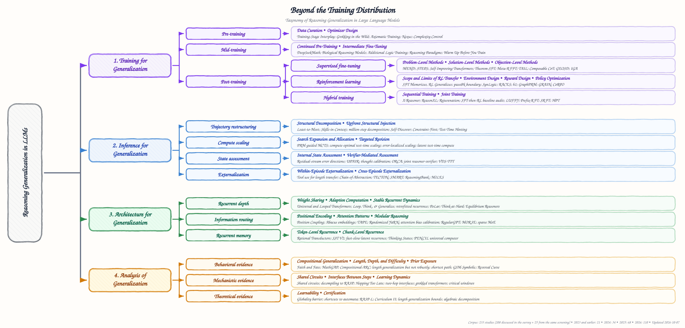

# Beyond the Training Distribution: A Survey of Reasoning Generalization in Large Language Models

This is the Markdown version of the survey. Its taxonomy is the one used for the paper list in [README.md](README.md), and every study it discusses is listed there with links. Statistics are computed from [`paper_manifest.tsv`](data/paper_manifest.tsv).

## Abstract

Large language models (LLMs) have achieved strong performance on mathematical, logical, and scientific reasoning tasks. However, this progress is commonly measured on benchmarks that remain close to the distributions encountered during training. Even small changes in notation, problem structure, reasoning depth, domain, or tool interface can lead to substantial performance degradation, raising a central question: do LLMs learn reusable reasoning procedures, or do they rely on patterns tied to familiar data? This survey reviews reasoning generalization in LLMs from four complementary perspectives: (1) training methods that encourage transferable reasoning, (2) inference strategies that adapt computation without changing model parameters, (3) architectural designs that support reusable operations, and (4) analyses that characterize when and why generalization succeeds or fails. Building on this taxonomy, we compare the assumptions, evaluation settings, and generalization claims of representative approaches, summarize the main empirical findings and theoretical results, and discuss the evaluation practices and open challenges that shape this research direction.

## 1. Introduction

Recent advances in prompting, post-training, and test-time computation have substantially improved the reasoning capabilities of large language models. Models can now solve difficult mathematical problems, construct multi-step proofs, and interact with external tools. These achievements have encouraged a shift from asking whether LLMs can reason to asking whether the reasoning procedures they acquire remain effective beyond familiar data.

Reasoning generalization remains difficult. Models that perform well on standard benchmarks can be unstable under equivalent numerical variants and irrelevant clauses ([Mirzadeh et al., 2025](https://arxiv.org/abs/2410.05229)), deteriorate as proof trees become deeper or wider ([Opedal et al., 2025](https://arxiv.org/abs/2410.13502)), and fail when familiar scientific domains are combined in unfamiliar ways ([Zhiren et al., 2026](https://arxiv.org/abs/2605.14754)). Similar failures arise under symbol remapping, longer inputs, new task compositions, and changed tool interfaces. These observations suggest that success on held-out examples does not necessarily imply that a model has learned a reusable reasoning procedure.

The problem is further complicated by the many meanings of "unseen". A task may be absent from supervised fine-tuning but still resemble pre-training data. An inference method may solve a new problem by drawing more samples or calling a tool, without changing the capability of the underlying model. Results also span different levels of analysis, from behavioral evaluations of frontier LLMs to mechanistic studies of small transformers and formal results under restricted assumptions. Without a clear account of the training exposure, the test shift, and the system components that remain fixed, different forms of generalization are easily conflated.

Research on this problem has developed along several complementary directions. Training methods seek data, objectives, and curricula that favor transferable procedures. Inference methods use prompting, search, verification, memory, and tools to deploy a fixed model on unfamiliar tasks. Architectural studies investigate recurrent computation, positional structure, locality, and modular execution. A parallel body of analytical work studies behavioral regularities, internal mechanisms, and theoretical limits. Existing surveys examine broad NLP generalization ([Hupkes et al., 2023](https://arxiv.org/abs/2210.03050)), out-of-distribution learning ([Liu et al., 2021](https://arxiv.org/abs/2108.13624)), inductive reasoning ([Chen et al., 2025b](https://arxiv.org/abs/2510.10182)), or generalization in language-model agents ([Zhang et al., 2025b](https://arxiv.org/abs/2509.16330)). These literatures have not been organized around their shared goal of transferring reasoning procedures across explicit distribution shifts.

This survey provides a unified view of reasoning generalization in LLMs. As shown in Figure 1, we organize the literature into three intervention-oriented pillars, Training for Generalization (Section 3), Inference for Generalization (Section 4), and Architecture for Generalization (Section 5), together with an Analysis of Generalization pillar (Section 6). This organization connects how transferable reasoning may be learned, how it may be elicited or extended at inference time, which computational structures support it, and how the resulting behavior can be explained.

  

*Figure 1: Taxonomy of reasoning generalization in LLMs. Training is organized by stage and, within each stage, by the component a method modifies; inference by the level of the reasoning process it acts on; architecture by depth recurrence, information routing, and state recurrence; and analysis by the type of evidence. Each leaf lists representative studies; the complete list is in the README.*

Our contributions are threefold.

1. **Unified taxonomy.** We develop a structured taxonomy that connects training, inference, architecture, and analysis while distinguishing model-level, procedure-level, and system-level generalization.
2. **Systematic synthesis.** We compare representative work across distribution shifts and identify recurring principles, including reusable intermediate operations, stable iterative computation, and compatibility between training and inference.
3. **Evaluation framework.** We consolidate the evidence into a generalization matrix that makes the reference exposure, test shift, inference budget, and strength of evidence explicit.

The review protocol and corpus statistics are given in Appendix A.

## 2. Preliminaries

**Definitions.** Let $x$ denote a reasoning problem, $y$ its answer, and $a$ the inference procedure applied by a model with parameters $\theta$. The resulting system is written as $f_{\theta,a}(x)$, with expected risk

$$
R_P(\theta, a) = \mathbb{E}_{(x,y)\sim P}\left[\ell\left(f_{\theta,a}(x), y\right)\right]
$$

on a distribution $P$. Evaluation is in-distribution (ID) when training and test examples follow the same relevant data-generating process, and out-of-distribution (OOD) when a specified property of that process changes ([Liu et al., 2021](https://arxiv.org/abs/2108.13624)). We use *reasoning generalization* to describe the ability to preserve a reasoning procedure under such a change. This includes compositional generalization to new combinations of familiar primitives ([Lake and Baroni, 2018](https://arxiv.org/abs/1711.00350)) and length generalization to longer or deeper instances ([Anil et al., 2022](https://arxiv.org/abs/2207.04901)).

**Generalization dimensions.** Reasoning tasks can move beyond their training distribution along several axes (Table 5). These shifts test different abilities. A model may tolerate symbol renaming while failing on deeper compositions, or transfer to a new domain while remaining sensitive to output format. When several axes change together, the source of improvement or failure becomes harder to identify.

*Table 5: Axes along which reasoning evaluations shift between training and test.*

| Shift axis | Train to test | What it probes |
| --- | --- | --- |
| Instance | New samples, same generator | Statistical generalization |
| Surface / format | Paraphrase, renamed symbols, new notation | Invariance to irrelevant form |
| Composition | New combinations of seen primitives | Rule reuse and recombination |
| Length / depth | Longer inputs, more hops, deeper nesting | Extrapolation of iteration |
| Difficulty | Easier or harder than the training range | Transfer across capability regimes |
| Task / domain | New task family or subject | Portability of procedures |
| Language / modality | Other language, format, image, audio | Reasoning versus interface |
| Environment / tool | New APIs, dynamics, rewards | Agentic and procedural transfer |
| Knowledge | New facts, familiar rules | Rule use on new content |

**Levels of generalization.** We separate three levels according to which components remain fixed. *Model-level* generalization concerns the behavior of the learned parameters under a fixed decoding procedure. *Procedure-level* generalization also includes prompting, search, or another inference algorithm. *System-level* generalization further includes retrievers, verifiers, memories, tools, and environments. For example, a tool-augmented system may solve longer problems even when the base model has not learned a length-general algorithm. When ID and OOD losses are comparable, the transfer gap can be written as

$$
\mathcal{G}(a) = R_{\mathrm{OOD}}(\theta, a) - R_{\mathrm{ID}}(\theta, a)
$$

and interpreted together with the inference cost $C(a)$. Because LLMs pass through pre-training, intermediate training, SFT, RL, and possible test-time adaptation, the stage that defines prior exposure must also be stated ([Ni et al., 2025](https://arxiv.org/abs/2510.15990)).

**Overview.** Four elements are needed to interpret a reasoning-generalization result (Figure 2).

1. **Reasoning task and fixed unit.** What is solved, and which parts stay constant: weights, prompt, controller, verifier, memory, tools.
2. **Reference exposure.** Which stage defines "seen": pre-training, mid-training, SFT or distillation, RL, or test-time adaptation.
3. **Test shift.** Which axis moves: instance, surface, composition, length or depth, difficulty, domain, language or modality, environment, knowledge.
4. **Evidence.** How transfer is shown: behavioral outcomes, representational associations, causal interventions, or formal results under explicit assumptions.

*Figure 2: Four elements of a reasoning-generalization claim.*

Behavioral evidence measures performance under a specified shift; representational evidence identifies internal correlates; causal-mechanistic evidence intervenes on a proposed mechanism; and theoretical evidence establishes a result under explicit assumptions. Based on the main contribution of each study, we then organize the literature by parameter-changing training methods, fixed-model inference methods, architectural properties, and analytical studies. Methods that span several pillars are discussed according to their primary source of generalization.

## 3. Training for Generalization

Training-based methods pursue reasoning generalization at the model level (Section 2), updating the parameters so that learned reasoning remains valid under shifts in surface form, composition, length, difficulty, domain, or language. The central challenge is that training can reinforce any pattern that fits the training data, including shortcuts that break under shift ([Dziri et al., 2023](https://arxiv.org/abs/2305.18654); [Mirzadeh et al., 2025](https://arxiv.org/abs/2410.05229)). How training handles this challenge depends on both when it intervenes and which component it modifies; we therefore organize these methods by training stage and, within each stage, by the component they modify (datasets and protocols are in Appendix C).

### 3.1 Pre-Training

At the earliest stage, pre-training shapes the reasoning primitives (that is, the basic operations) of the model and thus bounds generalization in later stages, which can recombine existing primitives into unseen compositions but can hardly supply a missing one ([Zhang et al., 2025a](https://arxiv.org/abs/2512.07783); [Yue et al., 2025](https://arxiv.org/abs/2504.13837)). By the component they modify, methods fall into two categories: data curation and optimizer design.

**Data curation.** This class of methods improves generalization by controlling what the pre-training corpus contains. One strategy concerns coverage: later training extrapolates to more complex compositions only when the required primitives appear in the corpus ([Zhang et al., 2025a](https://arxiv.org/abs/2512.07783)). A complementary strategy controls how much must be inferred rather than recalled: the ratio of inferred to stated facts decides whether a transformer memorizes its corpus or acquires a rule that holds on unseen facts ([Wang et al., 2024a](https://arxiv.org/abs/2405.15071)), and raising this ratio with synthesized facts can move multi-hop reasoning from memorization to generalization ([Abramov et al., 2025](https://arxiv.org/abs/2504.20752)). A caveat is that this evidence comes mostly from transformers trained from scratch on synthetic corpora rather than from LLMs ([Wang et al., 2024a](https://arxiv.org/abs/2405.15071); [Vashishtha et al., 2024](https://arxiv.org/abs/2407.07612)).

**Optimizer design.** Rather than changing the corpus, these methods change how the model is optimized on it, as solutions that fit the corpus equally well can behave differently out of distribution ([Chen et al., 2026a](https://arxiv.org/abs/2604.09258)). Nexus maximizes the similarity between gradients of different pre-training sources, yielding better OOD generalization at the same pre-training loss ([Chen et al., 2026a](https://arxiv.org/abs/2604.09258)). Complexity control ([Zhang et al., 2024c](https://arxiv.org/abs/2405.05409); [Zhang et al., 2025d](https://arxiv.org/abs/2501.08537)) uses a small initialization and a stronger weight decay, biasing the model toward capturing the primitives of a problem rather than memorizing it, and thereby generalizes to newly introduced or unseen compositions. This view is tempered by the finding that generalizing solutions reached by training far beyond overfitting transfer poorly to new knowledge ([He et al., 2026](https://arxiv.org/abs/2601.09049)).

### 3.2 Mid-Training

Mid-training inserts a stage before task-specific adaptation, because a model lacking a skill required by the target tasks tends to memorize them during post-training rather than acquire that skill ([Zhang et al., 2025a](https://arxiv.org/abs/2512.07783); [Jin et al., 2025](https://arxiv.org/abs/2509.12235)). By the objective of this stage, we distinguish two approaches.

**Continued pre-training.** These methods apply next-token prediction to raw text from an under-represented domain, so that later training there no longer starts out of distribution ([Shao et al., 2024](https://arxiv.org/abs/2402.03300); [Fesser et al., 2026](https://arxiv.org/abs/2606.16517)). In biological reasoning models, continued pre-training improves downstream performance by aligning the model with the language of the domain, while each later stage reshapes ID and OOD performance differently ([Fesser et al., 2026](https://arxiv.org/abs/2606.16517)).

**Intermediate fine-tuning.** These methods train on solved problems that require no domain knowledge, so that the acquired reasoning can transfer across tasks. Additional Logic Training uses program-generated deduction problems, with gains extending to other domains ([Morishita et al., 2024](https://arxiv.org/abs/2411.12498)), and fine-tuning on symbolic deduction, induction, and abduction problems generalizes to realistic problems in natural language ([Cao et al., 2026](https://arxiv.org/abs/2602.08658)). Intermediate fine-tuning can also prepare later training: after a warm-up on logic puzzles or on diverse self-generated solutions, RL generalizes better across domains and to OOD tasks ([Shrestha et al., 2025](https://arxiv.org/abs/2505.13718); [RRV et al., 2026](https://arxiv.org/abs/2605.08472)), and once atomic skills are in place, RL composes separately learned skills into novel combinations ([Cheng et al., 2025a](https://arxiv.org/abs/2512.01970)).

### 3.3 Post-Training

Post-training fine-tunes the model on reasoning tasks and is where the gap between in-distribution and OOD performance most easily opens: a model accurate on training tasks can still fail on rephrased, longer, or out-of-domain problems ([Mirzadeh et al., 2025](https://arxiv.org/abs/2410.05229); [Opedal et al., 2025](https://arxiv.org/abs/2410.13502); [Zhiren et al., 2026](https://arxiv.org/abs/2605.14754)). We distinguish supervised fine-tuning (SFT), reinforcement learning (RL), and hybrid training.

#### 3.3.1 Supervised Fine-Tuning

SFT trains the model to imitate demonstrations, that is, step-by-step solutions to training problems, and thus tends to memorize their spurious surface correlations, becoming brittle under shift ([Chu et al., 2025](https://arxiv.org/abs/2501.17161); [Peng et al., 2026](https://arxiv.org/abs/2605.09270)). Accordingly, SFT methods intervene at the level of the problems, the solutions, or the objective.

**Problem-level methods.** This line of work modifies the training problems so that the shift anticipated at test time is already represented in training.

- *Problem rewriting* presents each problem in variants that differ only in solution-irrelevant details, so that the answer stays fixed under surface shift. MEND reorders and adds redundant sentences, improving consistency on unseen surface variants ([Yao et al., 2025b](https://arxiv.org/abs/2502.17800)), and causality-aware post-training intervenes on problem events to break their spurious correlation with the answer, surpassing standard SFT both in distribution and OOD ([Gui and Ji, 2025](https://arxiv.org/abs/2506.09433)).
- *Problem generation* creates problems for regions the original data does not cover. STEPS synthesizes problems for rare skill combinations, improving compositional generalization ([Wei et al., 2026](https://arxiv.org/abs/2601.03676)), and self-improvement on slightly harder self-labeled problems reaches problems far longer than the initial ones ([Lee et al., 2025](https://arxiv.org/abs/2502.01612)). Similarly, problems can be ordered or selected by difficulty to generalize to harder or OOD problems ([Liu et al., 2026b](https://arxiv.org/abs/2609.25643); [Liu et al., 2026d](https://arxiv.org/abs/2605.12906)), although difficulty ordering shows no robust advantage over random sampling for compositional generalization in deduction ([Mordig et al., 2026](https://arxiv.org/abs/2603.27226)).

**Solution-level methods.** In contrast, these methods rewrite the solutions that the model imitates. The central insight is that imitation generalizes only as far as its target does, so only a target that exposes a reusable procedure transfers to new problems ([Peng et al., 2026](https://arxiv.org/abs/2605.09270); [Matsutani et al., 2026](https://arxiv.org/abs/2605.28008)).

- *Abstract solutions* remove problem-specific details to address surface and domain shift. Chain-of-Meta-Thought teaches an abstract strategy before adapting it to a problem, improving both in-distribution and OOD accuracy ([Wang and Zhang, 2026](https://arxiv.org/abs/2601.21909)), and Theorem-SFT supervises the application of general rules rather than surface patterns ([Peng et al., 2026](https://arxiv.org/abs/2605.09270)).
- *Stepwise solutions* write out every step of a rule so that it can run for more steps or combine with others, addressing length and compositional shift ([Hu et al., 2024](https://arxiv.org/abs/2402.17709); [Wang et al., 2025](https://arxiv.org/abs/2502.18273)). Meta-RFFT trains rule execution across many tasks, achieving length generalization even on unseen tasks ([Hu et al., 2025b](https://arxiv.org/abs/2502.11525)); TAIL imitates Turing-machine execution and retains accuracy on inputs several times longer than in training ([Hua et al., 2025](https://arxiv.org/abs/2507.13332)); and Composable CoT formats basic-task solutions so that separately learned skills combine on unseen combinations ([Yin et al., 2025](https://arxiv.org/abs/2505.22635)). Each target addresses a single shift: TAIL, for instance, reports limited compositional generalization ([Hua et al., 2025](https://arxiv.org/abs/2507.13332)).

**Objective-level methods.** Inspired by knowledge distillation ([Hinton et al., 2015](https://arxiv.org/abs/1503.02531)) and by invariance-based regularization from domain generalization ([Arjovsky et al., 2019](https://arxiv.org/abs/1907.02893)), these methods modify the loss so that what would not hold under shift contributes less to the update.

- *Teacher-based objectives* match the output distribution of a teacher rather than a single written solution. On-policy distillation lets the teacher score the student's own solutions, removing their mismatch with the expert solutions seen in training, and transfers across domains, reasoning horizons, and languages ([Li et al., 2026b](https://arxiv.org/abs/2608.16647); [Wang et al., 2026b](https://arxiv.org/abs/2608.06347)). GEOSD attenuates the loss on tokens the student cannot yet support ([Jukic and Titov, 2026](https://arxiv.org/abs/2607.06855)), and ROSD applies it only to the first erroneous span ([Zhao et al., 2026c](https://arxiv.org/abs/2605.28014)), both improving OOD accuracy over standard distillation. Despite these gains, a teacher given rich privileged information can suppress the student's uncertainty and degrade accuracy on unseen problems ([Kim et al., 2026](https://arxiv.org/abs/2603.24472)).
- *Regularization-based objectives* constrain or reweight the imitation loss. Invariant Gradient Alignment keeps only the gradient directions shared by surface variants of logically equivalent problems ([Cheng et al., 2026](https://arxiv.org/abs/2606.05025)), and GLOW reweights samples, including wrong-answer ones, by how much their loss still decreases ([Tian et al., 2026](https://arxiv.org/abs/2601.04992)); both outperform standard SFT on OOD problems.

#### 3.3.2 Reinforcement Learning

Unlike SFT, RL replaces reference solutions with a reward, usually whether a checker accepts the final answer, and updates the model toward its higher-reward samples ([Shao et al., 2024](https://arxiv.org/abs/2402.03300)). Strategies in the RL loop target one of three components: the environment, the reward, or the policy update. Before turning to them, we summarize what controlled studies say about the reach of RL itself.

**Scope and limits of RL transfer.** Without imitation, RL is reported to generalize to problem variants and domains on which SFT degrades ([Chu et al., 2025](https://arxiv.org/abs/2501.17161); [Huan et al., 2025](https://arxiv.org/abs/2507.00432)). In controlled settings it can also compose known skills into new ones ([Yuan et al., 2025](https://arxiv.org/abs/2509.25123); [Park et al., 2025](https://arxiv.org/abs/2512.01775)). Yet RL generalization remains bounded: OOD gains appear mainly when the target task aligns with pre-training ([Ni et al., 2025](https://arxiv.org/abs/2510.15990)), better pass@1 can coexist with unchanged or lower large-$k$ coverage ([Yue et al., 2025](https://arxiv.org/abs/2504.13837)), and accuracy collapses a few times beyond the training depth ([Wang et al., 2026a](https://arxiv.org/abs/2605.06638)).

**Environment design.** These methods change the problems and checkers the model practices on. SynLogic and Enigmata generate checkable puzzles by program and generalize to OOD puzzles and other domains ([Liu et al., 2025a](https://arxiv.org/abs/2505.19641); [Chen et al., 2025a](https://arxiv.org/abs/2505.19914)); RACES composes existing environments recursively, generalizing to unseen benchmarks ([Xiang et al., 2026](https://arxiv.org/abs/2606.12373)); and h1 chains short problems into longer ones, transferring to longer and harder problems ([Motwani et al., 2025](https://arxiv.org/abs/2510.07312)). Even fictional-knowledge or game environments transfer to real-world problems ([Kabra et al., 2026](https://arxiv.org/abs/2603.02091); [Feng et al., 2026](https://arxiv.org/abs/2604.17696)). Environments can also be defined by the inference-time controller: training across compositions of reusable reasoning modules generalizes to held-out controller compositions ([Choudhury et al., 2026](https://arxiv.org/abs/2607.23771)).

**Reward design.** These methods change what is rewarded. Process rewards score intermediate steps, favoring a correct procedure over a shortcut that works only in distribution ([Salimi et al., 2026](https://arxiv.org/abs/2608.14791); [Peng et al., 2025](https://arxiv.org/abs/2503.00845)). GRAIN rewards extracting the structure of a problem regardless of its narrative, substantially narrowing the OOD gap of SFT ([Yuan et al., 2026](https://arxiv.org/abs/2608.27142)), and AbstRaL rewards abstracting a problem, yielding robustness to surface perturbations ([Gao et al., 2025a](https://arxiv.org/abs/2506.07751)). Other rewards favor consistent answers across languages, transferring reasoning to unseen languages ([Elhady et al., 2026](https://arxiv.org/abs/2606.01464)), or diverse solutions, improving out-of-domain accuracy ([Hu et al., 2025c](https://arxiv.org/abs/2509.26209); [Zhou et al., 2025](https://arxiv.org/abs/2509.15194); [Maniparambil et al., 2026](https://arxiv.org/abs/2605.29190)).

**Policy optimization.** These methods change how the reward becomes an update. Gradient regularization steers training toward flatter regions where the reward is more accurate, thus avoiding reward hacking, that is, the exploitation of flaws in the reward ([Ackermann et al., 2026](https://arxiv.org/abs/2602.18037)). CoRPO prevents incorrect solutions from receiving a positive update ([Garg et al., 2025](https://arxiv.org/abs/2511.04439)), and RL-PLUS adds external solutions through importance sampling ([Dong et al., 2025](https://arxiv.org/abs/2508.00222)); both strengthen OOD transfer.

#### 3.3.3 Hybrid Training

Hybrid methods combine demonstrations that introduce procedures the model cannot learn on its own with rewards that recover the OOD accuracy reduced during SFT ([Jin et al., 2025](https://arxiv.org/abs/2509.12235); [Fesser et al., 2026](https://arxiv.org/abs/2606.16517)). Depending on how the two signals are scheduled, we distinguish two designs.

**Sequential training.** SFT followed by RL transfers reasoning to other domains, modalities, and languages ([Liu et al., 2025b](https://arxiv.org/abs/2505.03981); [Gurgurov et al., 2026](https://arxiv.org/abs/2604.12378)). Because excessive SFT leaves RL unable to improve, Rejuvenation partially resets the model toward its base weights before RL, restoring OOD gains ([Liu et al., 2026c](https://arxiv.org/abs/2606.09932)).

**Joint training.** These methods combine the two signals within one stage, either in the sampled solutions ([Yan et al., 2025](https://arxiv.org/abs/2504.14945); [Huang et al., 2025d](https://arxiv.org/abs/2507.01679)) or in the loss ([Fu et al., 2025](https://arxiv.org/abs/2506.19767); [Lv et al., 2025](https://arxiv.org/abs/2509.04419); [Hu et al., 2026](https://arxiv.org/abs/2605.26184); [Ma et al., 2025a](https://arxiv.org/abs/2506.07527); [Zhu et al., 2026](https://arxiv.org/abs/2604.08926)), and several report higher OOD accuracy than RL alone ([Yan et al., 2025](https://arxiv.org/abs/2504.14945); [Fu et al., 2025](https://arxiv.org/abs/2506.19767); [Lv et al., 2025](https://arxiv.org/abs/2509.04419)). This advantage is challenged by [Limozin et al. (2026)](https://arxiv.org/abs/2604.23747): with corrected baselines, sequential training surpasses these joint methods, including OOD (Table 1). The originally published results are kept separate in Table 12.

*Table 1: Accuracy (%) from [Limozin et al. (2026)](https://arxiv.org/abs/2604.23747). All rows use Qwen2.5-Math-7B and OpenR1-Math-46k-8192. Corrected baselines report mean and standard deviation over three independent runs; mixed-policy reproductions use one run. Math avg. covers six benchmarks and OOD avg. covers the three displayed benchmarks. Training compute is not matched across all rows.*

| Method | Math avg. | ARC-C | GPQA-D | MMLU-Pro | OOD avg. |
| --- | --- | --- | --- | --- | --- |
| Corrected SFT | 52.2 +/- 0.2 | 82.5 +/- 0.6 | 24.6 +/- 2.9 | 50.2 +/- 0.3 | 52.4 +/- 1.1 |
| SFT then RL (50 steps) | 55.6 +/- 0.5 | 84.0 +/- 0.5 | 39.6 +/- 1.0 | 53.9 +/- 0.4 | 59.2 +/- 0.2 |
| SFT then RL (500 steps) | 57.0 +/- 0.3 | 84.0 +/- 0.7 | 40.6 +/- 1.8 | 55.1 +/- 0.6 | 59.9 +/- 0.9 |
| LUFFY (reproduced) | 46.3 | 81.4 | 41.8 | 50.9 | 58.0 |
| ReLIFT (reproduced) | 48.8 | 80.7 | 36.7 | 51.3 | 56.2 |

### 3.4 Training Synthesis

Overall, these techniques support the view that reasoning generalization depends not on a single objective but on the interplay of all components throughout training. Table 6 summarizes what each branch transfers, its strongest current evidence, and its main risk.

*Table 6: Training branches: what transfers, the strongest evidence, and the main risk.*

| Training branch | Transfer mechanism | Strongest current evidence | Main risk |
| --- | --- | --- | --- |
| Pre-training | Establish reusable primitives before adaptation | Controlled training-stage and large-pass@$k$ comparisons | Opaque exposure makes the boundary hard to identify |
| Mid-training | Expose procedures or domains absent from base training | Program-generated logic and symbolic-to-natural transfer; warm-up before RL | More data may repeat the same shortcut |
| SFT and distillation | Teach explicit operations and reachable traces | Checkpoint sweeps, cross-model transfer, logically isomorphic OOD tests, unseen skill combinations | Teacher forcing, late-stage overfitting, suppressed uncertainty, specialization to the observed combinations |
| RL and RLVR | Select and sometimes compose procedures with outcome or process feedback | Held-out domains, capability-controlled pass@$k$, composed environments, held-out controller compositions | Reward hacking, entropy collapse, domain interference, dependence on base competence |
| Hybrid SFT and RL | Combine demonstrations with on-policy exploration | Shared ID/OOD protocol on OpenR1-Math-46k (Table 1) | Gains shrink against correctly implemented SFT then RL; single-seed comparisons |

## 4. Inference for Generalization

Autoregressive generation can rapidly compound errors on out-of-distribution tasks. To mitigate this failure mode, test-time interventions operate at different levels of the reasoning process: restructuring individual trajectories (trajectory restructuring), expanding candidate search (compute scaling), assessing state reliability (state assessment), and externalizing working state or experience (inference-time externalization). These interventions remain bounded by intrinsic capabilities; inference scaling cannot synthesize algorithmic reasoning that is entirely absent from the training distribution ([Tong et al., 2026](https://arxiv.org/abs/2604.15306)).

### 4.1 Trajectory Restructuring

When extrapolating to OOD problems, restructuring methods reshape the generation space without updating model weights by imposing structural priors on reasoning trajectories. These priors can be introduced dynamically as reasoning unfolds or upfront before formal reasoning begins.

**Structural decomposition.** To mitigate error accumulation on problems substantially longer or harder than the training data, models decompose reasoning into manageable units ([Zhou et al., 2023](https://arxiv.org/abs/2205.10625); [Zhang et al., 2024b](https://arxiv.org/abs/2402.05359)). This decomposition can be made increasingly fine-grained: micro-agent methods break complex reasoning into small, independently executed steps ([Meyerson et al., 2025](https://arxiv.org/abs/2511.09030)), while skill-based approaches organize the solution around predefined atomic reasoning skills ([Chen et al., 2024](https://arxiv.org/abs/2308.00304)).

**Upfront structural injection.** Rather than restructuring the trajectory as it unfolds, these methods impose structure before reasoning begins. Such step-zero interventions can restrict the space of valid answers ([Ma et al., 2026](https://arxiv.org/abs/2608.05254)), construct a reasoning procedure tailored to the task ([Zhou et al., 2024b](https://arxiv.org/abs/2402.03620)), synthesize demonstrations specific to the current query ([He et al., 2024b](https://arxiv.org/abs/2404.00884)), or supply hints that guide a black-box model on a new benchmark ([Hou et al., 2026](https://arxiv.org/abs/2605.16410)).

### 4.2 Compute Scaling

When a single trajectory is unreliable, inference can allocate additional test-time compute either to explore alternative reasoning paths or to selectively revise defective ones.

**Search expansion and allocation.** Rather than relying on brute-force sampling, search can be directed toward promising branches using process reward models and Monte Carlo tree search ([Chan et al., 2025](https://aclanthology.org/2025.findings-acl.388/)), while adaptive strategies adjust the balance between broad exploration and sequential revision according to the estimated difficulty of the problem ([Snell et al., 2024](https://arxiv.org/abs/2408.03314)). Training can also preserve the diversity that later sampling relies on ([Li et al., 2026a](https://arxiv.org/abs/2605.09853)).

**Targeted revision.** When errors are localized, computation can instead be concentrated on faulty reasoning steps, avoiding regeneration of the entire solution ([Chitale et al., 2026](https://arxiv.org/abs/2607.21453); [Chaudhry et al., 2026](https://arxiv.org/abs/2604.01430)).

### 4.3 State Assessment

As inference generates multiple candidate trajectories, it must determine which reasoning states remain trustworthy under distribution shift. This assessment can draw on signals internal to the reasoning model or on an auxiliary verification mechanism.

**Internal state assessment.** Internal representations and uncertainty signals can identify whether an intermediate reasoning state is likely to be correct and whether further reasoning is needed ([Damirchi et al., 2026](https://arxiv.org/abs/2608.05660); [Yan et al., 2026](https://arxiv.org/abs/2607.17188)). These signals can then be used to decide whether to continue the current reasoning process, switch to another strategy, or stop when the expected risk is sufficiently low ([Yan et al., 2026](https://arxiv.org/abs/2607.17188); [Wu et al., 2025](https://arxiv.org/abs/2505.18404)). Online calibration further updates these reliability estimates during inference, helping to maintain valid confidence estimates when the target distribution differs from the training distribution ([Zhou et al., 2026](https://arxiv.org/abs/2604.01170)).

**Verifier-mediated assessment.** When internal signals are insufficient, auxiliary verifiers provide another basis for selecting or adapting reasoning candidates. Joint reasoner-verifier training incorporates verification into inference-time candidate selection ([Sareen et al., 2025](https://arxiv.org/abs/2505.04842)), while verifier-guided test-time training uses high-confidence verification results to construct pseudo-labels and adapt the generator on unlabeled target data ([Moradi et al., 2025](https://arxiv.org/abs/2505.19475)). Verification itself can exhibit structural generalization limits as the target task changes ([Sarrof et al., 2026](https://arxiv.org/abs/2603.19954)).

### 4.4 Inference-Time Externalization

Even when trajectories are scaled and assessed, the capabilities available within a single internal inference process remain bounded. Inference-time externalization expands this boundary by making working state, tool-mediated computation, or accumulated experience available beyond the current reasoning process. The distinction is whether this information is used only within the current task or retained for subsequent tasks.

**Within-episode externalization.** Within a single task, externalization can extend the available working state, separate abstract reasoning from externally supplied values, and control how external tools are used. External working memory can extend reasoning to sequences substantially longer than those seen during training ([Malach et al., 2026](https://arxiv.org/abs/2510.14826)), while chain-of-abstraction reasoning separates abstract reasoning from tool-supplied values under semantic shifts ([Gao et al., 2025b](https://arxiv.org/abs/2401.17464)). Effective tool use further requires selecting an appropriate tool for a given reasoning step ([Alazraki and Rei, 2025](https://arxiv.org/abs/2411.04535)) and recognizing when external tools are unnecessary ([Qian et al., 2025](https://arxiv.org/abs/2502.11435)).

**Cross-episode externalization.** Beyond a single task, systems can retain experience by distilling strategies from prior successes and failures into persistent memory ([Ouyang et al., 2025](https://arxiv.org/abs/2509.25140)). Once experience is retained, effective reuse requires structured retrieval, which can be supported through modular sub-instruction units and learned selection mechanisms while keeping the core reasoning model fixed ([Tong and Gong, 2026](https://arxiv.org/abs/2607.06974)).

### 4.5 Inference Synthesis

Table 7 summarizes when each branch helps, when it fails, and the control needed before claiming transfer. Table 14 lists the shifts and metrics on which representative interventions have been evaluated. We do not pool their scores, because base models, benchmarks, and inference budgets differ across studies; a fair comparison needs the compute-normalized protocol of Appendix B.

*Table 7: Inference branches: when they help, when they fail, and the control needed to claim transfer.*

| Inference branch | Best suited for | Failure condition | Required control |
| --- | --- | --- | --- |
| Trajectory restructuring | Misaligned task representation or missing intermediate structure | Decomposition is wrong or prompt-sensitive | Matched prompts and paraphrase tests |
| Compute scaling | Correct paths exist with low but nonzero probability | No useful candidate is generated | pass@$k$ and oracle-selection upper bound |
| State assessment | Errors are easier to detect than to avoid, or difficulty varies across examples | The verifier shares the generator's shortcut, or the monitor is source-specific | Independent checks and source-target accuracy-cost frontiers |
| Inference-time externalization | Exact operations or reusable skills can be externalized | Tool routing or retrieval fails | Tool-free and retrieval-distance controls |

*Table 14: Shifts and metrics used to evaluate representative inference-time interventions.*

| Method | Branch | Evaluated shift (ID to OOD) | Metric |
| --- | --- | --- | --- |
| Least-to-Most ([Zhou et al., 2023](https://arxiv.org/abs/2205.10625)) | Structural decomposition | Length (SCAN non-length split to length split) | Exact match |
| Constraint-First Reasoning ([Ma et al., 2026](https://arxiv.org/abs/2608.05254)) | Upfront structural injection | Difficulty (AIME to OlympiadBench) | pass@1 |
| Test-Time Hinting ([Hou et al., 2026](https://arxiv.org/abs/2605.16410)) | Upfront structural injection | Domain (A-OKVQA to RealWorldQA) | Accuracy |
| Error-localized test-time scaling ([Chitale et al., 2026](https://arxiv.org/abs/2607.21453)) | Targeted revision | Domain (LiveCodeBench to AIME/HMMT) | F1 |
| Latent test-time thinking ([Chaudhry et al., 2026](https://arxiv.org/abs/2604.01430)) | Targeted revision | Algorithmic (ID graph to reversal) | Exact match |
| UPAIR ([Yan et al., 2026](https://arxiv.org/abs/2607.17188)) | Internal state assessment | Domain (MATH to GPQA/LiveCodeBench) | Accuracy |
| Tool use in state-space models ([Malach et al., 2026](https://arxiv.org/abs/2510.14826)) | Within-episode externalization | Length (up to 10 digits to 1,000 digits) | Accuracy |
| ReasoningBank ([Ouyang et al., 2025](https://arxiv.org/abs/2509.25140)) | Cross-episode externalization | Environment (WebArena single-site to multi-site) | Success rate |
| MILES ([Tong and Gong, 2026](https://arxiv.org/abs/2607.06974)) | Cross-episode externalization | Domain (MATH to MMLU-Pro) | Sub-accuracy |

## 5. Architecture for Generalization

Architectural approaches change the computation available to a model: how it reuses transformations, connects representations, or carries state forward. We organize them into recurrent depth, information routing, and recurrent memory. Controlled transformer studies establish the underlying design principles; results on pretrained language models indicate how far these principles extend to broader reasoning tasks.

### 5.1 Recurrent Depth

Recurrent depth applies a transformation repeatedly within a prediction. Sharing its parameters allows additional iterations without learning a separate transformation for each depth. This can support length generalization when longer problems require more applications of the same update, as demonstrated on controlled algorithmic tasks ([Fan et al., 2025](https://arxiv.org/abs/2409.15647)).

**Weight sharing.** Universal Transformers implement this principle by sharing a transition across depth ([Dehghani et al., 2019](https://arxiv.org/abs/1807.03819)). Subsequent studies extend recurrence to deeper compositions of facts ([Kohli et al., 2026](https://arxiv.org/abs/2604.07822)) and to variable-depth compositional tasks, where a stabilized shared-weight block reveals a task-specific computational frontier ([Chen, 2026](https://arxiv.org/abs/2603.21676)). A circuit-based universal-transformer parameterization trained on depth-one and depth-two instances evaluates Boolean expressions of any depth, given fully parenthesized inputs and a positional encoding that tracks gate depth ([Ito et al., 2026](https://arxiv.org/abs/2608.31067)). For larger computation graphs, recurrence has been combined with structured latent supervision and error correction ([Altabaa et al., 2025](https://arxiv.org/abs/2510.14095)), and aligning loop iterations with chain-of-thought steps lets a looped transformer generate reasoning chains beyond the training length, which are then used to fine-tune an autoregressive model ([Yu et al., 2026](https://arxiv.org/abs/2502.08482)). Recent work brings recurrent blocks into pretrained language models: retrofitting a shared middle block supports depth extrapolation on controlled rule-following tasks, although transfer to verbal formulations remains limited ([Shapiro, 2026](https://arxiv.org/abs/2608.11233)). Looped language models also improve compositional tool calling, extending the evaluation from synthetic transitions to dependent sequences of tool calls ([Popescu et al., 2026](https://arxiv.org/abs/2608.18171)).

**Adaptive computation.** Reusing a block leaves open how many iterations to execute. A learned controller can vary this budget across inputs or tokens, allowing computation to follow the demands of the problem; Hyper-UT combines such adaptive depth with dynamically generated modules to generalize over the number of computation steps ([Abnar et al., 2023](https://arxiv.org/abs/2310.08866)). PoLar learns input-dependent programs that skip or repeat groups of layers in a frozen backbone ([Li et al., 2026c](https://arxiv.org/abs/2606.06574)). Think-at-Hard selects tokens for additional latent iterations and reports transfer from math-only training to scientific reasoning ([Fu et al., 2026](https://arxiv.org/abs/2511.08577)). Learned stopping rules can also decide the loop count at test time, either stochastically to stabilize extrapolation ([Kuo et al., 2026](https://arxiv.org/abs/2606.29983)) or as algorithmic time that grows with the length of an addition problem ([Ibrahimli et al., 2026](https://openreview.net/forum?id=XW18V4H9sq)).

**Stable recurrent dynamics.** Such allocation does not guarantee that further iterations remain useful: recurrent states can drift as depth increases, making the dynamics of the learned update a separate condition for reliable extrapolation ([Viakhirev et al., 2026](https://arxiv.org/abs/2608.18222)). A fixed-point view characterizes when looped architectures reach meaningful, input-dependent fixed points ([Labovich, 2026](https://arxiv.org/abs/2604.15259)), and fixed-point convergence can serve as an end-to-end halting rule once signal propagation through depth is stabilized ([Movahedi et al., 2026](https://arxiv.org/abs/2606.18206)). Related models learn attractors ([Huang et al., 2026a](https://arxiv.org/abs/2605.21488)) or minimize a composition of learned energy functions at inference ([Oarga and Du, 2025](https://arxiv.org/abs/2510.20607)), so that further iterations move toward a stable solution rather than away from it.

### 5.2 Information Routing

Information routing specifies how tokens are addressed, which dependencies attention can access, and which modules process them. These designs aim to preserve the relations used by a computation when input length or composition changes. We distinguish positional encoding, attention patterns, and modular reasoning by the relation each constrains.

**Positional encoding.** Encoding a token's computational role can preserve alignment as the surrounding sequence grows. Position Coupling assigns shared position identifiers to digits of equal significance across operands ([Cho et al., 2024](https://arxiv.org/abs/2405.20671)), while Abacus embeddings encode digit positions within each number ([McLeish et al., 2024](https://arxiv.org/abs/2405.17399)). Other arithmetic studies improve extrapolation through structural symmetry or alternative positional descriptions ([Sabbaghi et al., 2024](https://arxiv.org/abs/2406.01895); [Shen et al., 2023](https://arxiv.org/abs/2311.14737)). Multi-level position coupling extends this approach to shifts in both operand length and count, together with task-specific scratchpads ([Cho et al., 2025](https://arxiv.org/abs/2410.15787)). Moving beyond fixed task coordinates, TAPE updates positional representations using sequence context and supports algorithmic length extrapolation ([Zhu et al., 2025](https://arxiv.org/abs/2501.00712)). Randomizing positions during training reduces the mismatch for unseen indices, both with random float positions ([Shimizu et al., 2026](https://arxiv.org/abs/2602.14050)) and with YaRN positional encodings sampled from a larger range than the short training contexts, which improves long-context reasoning ([Mehta et al., 2026](https://arxiv.org/abs/2606.23687)), and the training data itself determines which rotary frequencies a model uses and therefore how it extrapolates ([Wu et al., 2026](https://arxiv.org/abs/2607.07678)). These results establish transfer under particular encodings, with the arithmetic evidence concentrated in specialized models.

**Attention patterns.** Attention constraints specify which intermediate results a later computation can retrieve. Repeating a suitable dependency pattern at longer lengths can preserve a local operation without exposing it to every additional token. Attention Bias Calibration extrapolates attention patterns learned on shorter examples into biases that support arithmetic length generalization ([Duan et al., 2023](https://arxiv.org/abs/2310.11984)). RegularGPT instead combines sliding-dilated attention with shared recurrent layers, composing local computations over progressively larger spans to recognize regular languages beyond training lengths ([Chi et al., 2023](https://arxiv.org/abs/2305.03796)). In visual reasoning, recurrent policies with strictly local perception avoid the global shortcuts that break under longer or more complex inputs ([Madan et al., 2026](https://arxiv.org/abs/2607.09061)).

**Modular reasoning.** Routing assigns parts of an input to specialized components so that familiar operations can be recombined. MORSE learns functional attention masks that specialize heads and coordinate their computation, improving generalization to longer and structurally different entailment trees ([Fu and Frank, 2024a](https://arxiv.org/abs/2309.07624)). Evidence from sparse expert models shows that the preferred number of active experts depends on compositional complexity, suggesting that routing sparsity should match the operations to be composed ([Zhao et al., 2026b](https://arxiv.org/abs/2410.13964)). Neuro-symbolic systems go further and compose explicit symbolic components, either symbolic representations generated by LLMs and mapped to differentiable neural computations for vision-language reasoning ([Kamali et al., 2025](https://arxiv.org/abs/2412.15588)) or causal graphs, induced logic, and theorem verification for interactive agents ([Shahid and Rothe, 2026](https://arxiv.org/abs/2604.26522)).

### 5.3 Recurrent Memory

Recurrent memory introduces an explicit update that carries an internal state across tokens or reasoning chunks. This gives later computation a representation of earlier results to reuse. Its potential for generalization depends on retaining the information needed for subsequent updates as the reasoning sequence grows.

**Token-level recurrence.** At token granularity, each input updates a state that conditions subsequent processing. Rational Transductors combine weighted-automaton state transitions with a transformer stream, providing theoretical and synthetic-task evidence for reusable sequential computation ([Mohri, 2026](https://arxiv.org/abs/2602.07599)). SST V2 blends a carried state into the feedforward layers of a pretrained language model and reports gains beyond its math fine-tuning domain ([Aviss, 2026](https://arxiv.org/abs/2605.00206)); however, its aggregate score across iteration depths measures the questions solved at any tested depth rather than the accuracy of a single stopping policy. In streaming tasks, a persistent latent state refined by several weight-shared updates per observation improves train-short, test-long generalization over recurrent, state-space, and transformer baselines ([Takashiro et al., 2026](https://arxiv.org/abs/2604.01577)).

**Chunk-level recurrence.** At a coarser granularity, a state summarizes one reasoning segment for the next. Thinking States compresses intermediate thoughts into a fixed-size state and injects it into subsequent chunks, improving length extrapolation on natural-language parity and variable-tracking tasks ([Amos et al., 2026](https://arxiv.org/abs/2602.08332)). The model retains access to the preceding context, so this evidence concerns the benefit of an additional state interface under length shift rather than a complete replacement of the reasoning history. Scaffolds that erase completed intermediate computation keep execution within a bounded context; with such a scaffold, a small transformer trained on random programs executes novel human-written programs ([Xu et al., 2026](https://arxiv.org/abs/2604.25166)).

## 6. Analysis of Generalization

The methods in Sections 3 to 5 show how to improve performance under a shift, but not what transfers. Analytical studies address that question with the evidence types of Section 2. Table 8 summarizes each line of analysis, and Appendix D expands each paragraph under the same heading.

*Table 8: Lines of analysis: the question each answers, its main finding, and the limit on interpreting it. Behavioral rows rest on performance under a named shift, mechanistic rows on representational or interventional evidence, and theoretical rows on results under explicit assumptions.*

| Line of analysis | Question answered | Main finding | Interpretation limit |
| --- | --- | --- | --- |
| *Behavioral (6.1)* | | | |
| Compositional generalization | Do familiar primitives transfer to new combinations? | Loss grows with the depth, width, and order of the combination | Template overlap can make recombination look like composition |
| Length, depth, and difficulty | Does the procedure continue beyond the trained range? | Transfer is partial, axis-specific, and sensitive to the training seed | A finite extrapolation range is not unbounded extrapolation |
| Prior exposure | How far does the test lie from earlier training exposure? | Benefits shrink as priors become sparse, conventions change, or facts are queried in the unseen direction | Pre-training exposure is inferred, not observed |
| *Mechanistic (6.2)* | | | |
| Shared circuits | Do successes on both sides of a shift share a computation? | Circuit overlap predicts format transfer and item-level correctness | Overlap on familiar data need not hold on the shifted split |
| Interfaces between steps | Can each step read the result of the previous one? | Bridge entities are bypassed, resolved too late, or stored out of reach; homomorphism error predicts transfer | Repairing patches are selected per case; training interventions may change more than the measured property |
| Learning dynamics | Which of several fitting solutions does training select? | Rules emerge late, can stay bound to seen facts, and depend on regularization timing | Tied to specific models, seeds, and checkpoints |
| *Theoretical (6.3)* | | | |
| Learnability | Will training on finite data select a procedure the model class can represent? | Training finds brittle shortcuts unless locality, diverse support, or symmetry favor extrapolating solutions | Representability does not imply learnability; assumptions rarely match LLM training |
| Certification | Can a finite test establish extrapolation? | Finite training lengths suffice for restricted classes; no computable test length covers all two-layer C-RASP programs | Positive results assume idealized training or cover verification only |

### 6.1 Behavioral Evidence

Behavioral studies find that transfer differs across shift axes, so a single OOD score hides the informative object: the profile of performance across named shifts, one row of the transfer matrix $M_{ij}$ (Appendix B). Passing a surface test, for instance, indicates invariance to that one transformation only.

**Compositional generalization.** Compositional tests keep the primitives fixed and change how they combine. Accuracy falls as the computation graph grows deeper and wider ([Dziri et al., 2023](https://arxiv.org/abs/2305.18654)). Even on two-hop questions, a model can store both facts and still fail to chain them ([Zhang et al., 2026](https://arxiv.org/abs/2608.07261)), and in the GPT-3 family this compositionality gap does not shrink as models grow ([Press et al., 2023](https://arxiv.org/abs/2210.03350)).

**Length, depth, and difficulty.** Length counts tokens or items, depth counts recursive or compositional steps, and difficulty places a problem in a capability regime. Transformers that handle longer non-nested sequences still fail on deeper nesting than they saw in training ([He, 2025](https://arxiv.org/abs/2512.02677)). Short-to-long transfer varies across random seeds even with suitable formats and positional encodings ([Zhou et al., 2024d](https://arxiv.org/abs/2402.09371)), and training only on easy or only on hard examples does not improve performance consistently across levels ([Kordi et al., 2026](https://arxiv.org/abs/2511.21692)).

**Prior exposure.** Whether a test is "unseen" depends on the exposure stage it is compared against. Accuracy drops systematically when familiar tasks move to counterfactual conventions such as an unfamiliar number base ([Wu et al., 2024](https://arxiv.org/abs/2307.02477)), and facts fine-tuned as "A is B" are not retrieved as "B is A" ([Berglund et al., 2024](https://arxiv.org/abs/2309.12288)). Transfer from RLVR appears only above a base-model competence threshold ([Lu et al., 2025](https://arxiv.org/abs/2512.20760)), so an RL effect cannot be read apart from the pre-training before it (Section 3.3.2).

Table 9 collects representative diagnostics for behavioral evaluation.

*Table 9: Representative diagnostic suite for behavioral reasoning-generalization evaluation.*

| Diagnostic | Primary shift | Main observation | Interpretation limit |
| --- | --- | --- | --- |
| GSM-Plus ([Li et al., 2024b](https://arxiv.org/abs/2402.19255)) | Statements and answer targets | Correctness is brittle even on variants of solved problems | Perturbations remain within grade-school arithmetic |
| GSM-Symbolic ([Mirzadeh et al., 2025](https://arxiv.org/abs/2410.05229)) | Numeric instantiation and distractor clauses | Equivalent templates yield unstable accuracy | Template generation cannot test every skill |
| MathGAP ([Opedal et al., 2025](https://arxiv.org/abs/2410.13502)) | Proof-tree depth, width, and shape | Accuracy declines with structural complexity | Generated word problems simplify language variation |
| Compositional-ARC ([Mondorf et al., 2025](https://arxiv.org/abs/2504.01445)) | Unseen transformation combinations | Meta-learned small models can exceed frontier LLM systematicity | Abstract spatial tasks are controlled but narrow |
| General365 ([Liu et al., 2026a](https://arxiv.org/abs/2604.11778)) | Domain and variant | Broad reasoning remains below specialized math performance | Variant construction may not remove familiarity |
| XDomainBench ([Zhiren et al., 2026](https://arxiv.org/abs/2605.14754)) | Cross-domain composition | Failure grows with composition order and interaction | Knowledge and reasoning are partly entangled |
| Numeric remapping ([Barker et al., 2026](https://arxiv.org/abs/2606.03606)) | Surface-preserving numeric change | Robustness differs sharply by dataset structure | Arithmetic word problems only |
| Elenchos ([Steiglechner et al., 2026](https://arxiv.org/abs/2607.12733)) | Abductive rule mutation | Detection is stronger than causal attribution | Formal systems are controlled but narrow |
| OOD visual planning ([Neuhaus et al., 2026](https://arxiv.org/abs/2602.15460)) | Map size and representation | CoT helps ID more than most OOD settings | Simple navigation does not span open-world planning |
| Chess generalization ([Pleiss et al., 2026](https://arxiv.org/abs/2601.16823)) | Density of useful priors | Performance falls as relevant priors become sparse | Training exposure is inferred, not observed |
| OMEGA ([Sun et al., 2025](https://arxiv.org/abs/2506.18880)) | Mathematical novelty type | Separates exploratory, compositional, and transformative transfer | Novelty taxonomy depends on task construction |
| CoT as a mirage ([Zhao et al., 2025](https://arxiv.org/abs/2508.01191)) | Data distribution | Apparent reasoning depends on distribution design | Behavioral evidence does not identify a mechanism |

**Key takeaways.**

- *Transfer is axis-specific.* Success on one named shift does not predict success on another.
- *Knowing is not composing.* Stored components can fail to combine, even at scale.
- *"Unseen" is stage-relative.* Apparent generality depends on the reference-exposure stage.

### 6.2 Mechanistic Evidence

Behavioral evidence shows where performance changes, not whether one procedure or separate shortcuts produce it. Mechanistic studies test for a computation shared across the shift, mostly in small controlled models, so they propose explanations rather than measure how common a mechanism is in frontier LLMs.

**Shared circuits.** If two problem variants are solved by the same procedure, their internal computations should overlap. In LLM arithmetic, the overlap between the circuits for numeric and verbal formats predicts which verbal format is hardest, which models transfer best, and which items are solved ([de Varda et al., 2026](https://arxiv.org/abs/2609.04463)). Yet a circuit that composes familiar facts can transfer poorly once it must use newly integrated knowledge ([He et al., 2026](https://arxiv.org/abs/2601.09049)).

**Interfaces between steps.** Each intermediate result must reach the next step in a form that step can read. In pre-trained LLMs, the bridge entity is resolved in early layers, but the second hop begins only in later layers that may no longer hold the needed knowledge, and a back-patch to an earlier layer, chosen per query, yields the correct answer for up to 66% of failed queries ([Biran et al., 2024](https://arxiv.org/abs/2406.12775)).

**Learning dynamics.** When several solutions fit the training data, the one a model reaches depends on the course of optimization. Grokked transformers generalize systematically out of distribution for comparison but not for composition ([Wang et al., 2024a](https://arxiv.org/abs/2405.15071)). In LLM post-training, OOD performance can peak early in SFT and then decline while ID performance still improves ([Jin et al., 2025](https://arxiv.org/abs/2509.12235)), so the evaluated checkpoint is part of the claim.

**Key takeaways.**

- *Overlap predicts transfer.* Shared circuits predict transfer across variants, yet can fail on new knowledge.
- *Failures sit at interfaces.* Computed intermediate results may not reach the next step.
- *Optimization selects the solution.* Training length and the evaluated checkpoint shape what transfers.

### 6.3 Theoretical Evidence

Theory separates three properties that empirical results run together: *expressivity*, whether a model class can represent a procedure that generalizes in length or composition; *learnability*, whether finite training selects it over shortcuts that fit the same data; and *certification*, whether a finite test can establish that it extrapolates. None implies the next, and each result holds only under its stated encoding, precision, and computation budget. Expressivity results enter this survey as the premise of learnability results (Appendix D.3); the two branches below collect results with an explicit generalization claim.

**Learnability.** Two conditions govern whether training selects the extrapolating procedure. One is locality: [Abbe et al. (2024)](https://arxiv.org/abs/2406.06467) show, theoretically under additional assumptions and experimentally, that targets with a high globality degree are not efficiently learnable by regular transformers, whereas inductive scratchpads, which condition each step only on the question and the previous state, break this barrier and improve length transfer. The other is inductive bias. [Liu et al. (2023)](https://arxiv.org/abs/2210.10749) prove that $O(\log T)$ layers suffice to simulate any finite automaton on inputs of length $T$, yet in their experiments standard training finds shortcuts that are brittle outside the training distribution.

**Certification.** [Yang et al. (2026a)](https://arxiv.org/abs/2603.02238) prove that no computable length generalization bound exists for C-RASP, already with two layers, so no computable test length certifies the whole class. Positive results concern restricted classes: for one- and two-layer transformers, length generalization provably occurs when behavior on longer sequences can be simulated by behavior on shorter ones seen in training ([Izzo et al., 2026](https://arxiv.org/abs/2510.27015)). Section 7 starts from these limits.

**Key takeaways.**

- *Representable is not learnable.* Expressible procedures need not be learned.
- *Locality and bias govern selection.* Global targets resist learning without local steps, and standard training can prefer brittle shortcuts.
- *Finite tests do not certify.* Accuracy on a finite range is evidence about that range alone.

## 7. Synthesis and Research Directions

### 7.1 Literature Landscape

The literature is unevenly distributed across the four perspectives. Among the 208 studies organized by this taxonomy, 72 analyze generalization, 71 study training, 40 examine architecture, and 25 concern inference-time methods. Most (153) appeared in 2025 or 2026, reflecting the rapid growth of the area rather than a deliberate preference for recent work. Appendix A describes the collection procedure and reports the distribution by year. The imbalance is itself informative: inference-time methods form the smallest group, and many of them are evaluated on familiar benchmarks rather than under a stated distribution shift, so methods that deploy a fixed model have been tested for transfer less often than methods that train it or diagnose its failures.

The four perspectives describe different parts of the same process. Training supplies reasoning primitives and determines which procedures are preferred. Architecture constrains which computations can be represented and repeated efficiently. Inference controls how a learned procedure is elicited, searched, checked, or supplemented with external resources. Analysis determines whether the resulting behavior survives the intended shift and whether the proposed explanation is supported. Improvements in one part do not automatically compensate for weaknesses in another. A chain of thought is useful when it exposes a reusable computation, not simply when it contains more tokens; recurrence helps when its update remains stable at greater depth; and tool use may extend system capability without making the underlying model length-general.

Several apparent disagreements in the literature arise from different claim boundaries. Greedy accuracy, large-pass@$k$ accuracy, and verifier-selected accuracy distinguish what a model produces reliably from what it can produce occasionally and from what a larger system can recover. Similarly, gains on a matched target distribution demonstrate specialization, whereas gains on held-out rows and columns of a transfer matrix provide evidence of reuse. The relevant unit may be the model, an inference procedure, or a complete system. Making this unit explicit permits meaningful comparison without forcing all work into a single notion of generalization.

### 7.2 Evaluation Framework

Reliable evaluation begins with an explicit account of what was seen during training, what changes at test time, and which components remain fixed. We recommend five reporting elements.

1. **Reference boundary.** Report the relevant pre-training, continued-training, supervised, distillation, and reinforcement-learning exposure, together with the components held fixed during evaluation.
2. **Shift construction.** Pair each OOD condition with a matched ID control, vary one factor at a time where possible, and include both surface and structural changes.
3. **Generation and selection.** Report greedy accuracy, pass@$k$, selected accuracy, oracle-selection accuracy, inference cost, and verifier errors under the same shift.
4. **Explanatory evidence.** Test the proposed mechanism with counterfactual rules or perturbations, multiple task families, training seeds, and model checkpoints. A causal intervention should be evaluated on the split used to establish the behavioral effect.
5. **Generalization matrix.** Cross training distributions with test conditions and report performance, uncertainty, and cost in each cell. Diagonal improvements indicate specialization; consistent off-diagonal improvements provide stronger evidence of transfer.

Appendix B develops these elements into a claim template and a generalization matrix.

### 7.3 Challenges and Future Directions

**Auditable test novelty.** Claims about unseen problems are difficult to verify when the pre-training corpus is unavailable. Newly released benchmarks help, but their templates, source problems, or solution patterns may still overlap with training data. Sealed generators, post-training evaluations, contamination analyses, and explicit collision checks can establish a clearer exposure boundary.

**Compound distribution shifts.** Most controlled evaluations vary a single factor, while deployed systems face simultaneous changes in domain, language, interface, knowledge, and difficulty. Factorial benchmarks are needed to reveal whether robustness along separate axes composes or whether the shifts interfere. Such evaluations should retain matched single-factor controls so that failures remain interpretable.

**Portable reasoning interfaces.** Circuits, memories, controllers, and distilled skills have transferred in restricted settings, but the field lacks a stable interface for moving them across model versions, architectures, and modalities. Representations that expose intermediate state without depending on a particular tokenizer or hidden dimension could make reasoning components easier to reuse and inspect.

**Cross-scale evidence.** Causal evidence is clearest in small controlled models, whereas the most consequential behavioral results come from frontier systems. Applying matched shifts and interventions across model scales would show which mechanisms persist and which are artifacts of simplified settings. This connection is necessary before local circuit findings can support broad claims about large-model reasoning.

**Joint training and inference design.** Models are commonly trained with one decoding process and deployed with another. Training across a family of inference controllers may produce representations that remain useful under different search, verification, and tool-use policies ([Choudhury et al., 2026](https://arxiv.org/abs/2607.23771)). Future work should evaluate such methods on accuracy, computational cost, faithfulness, and cross-distribution transfer together.

## 8. Conclusion

This survey presents a unified view of reasoning generalization in large language models through training, inference, architecture, and analysis. Across these perspectives, successful transfer depends on the relation between the learned procedure, the computation available at inference, and the structure of the target shift. Existing methods demonstrate promising transfer within specific regimes, yet no single intervention provides robust generalization across surface, compositional, length, domain, and tool changes. Progress will require evaluation settings that state the exposure boundary, distinguish model from system capability, and connect behavioral improvements with causal or theoretical explanations.

## Limitations

Our literature search covers work available through 10 September 2026 and draws primarily from arXiv, the ACL Anthology, and OpenReview. Because many recent studies are preprints, the maturity of the evidence varies across the corpus. The accompanying manifest records first and revised posting dates to support future updates. Our inclusion criterion also requires an explicit reasoning-related distribution shift. It therefore excludes some work on robustness, domain adaptation, long-context modeling, and agents when the contribution of reasoning cannot be separated from other capabilities. Conversely, a few representative methods in Sections 3 and 4 illustrate a branch of the taxonomy even though their own evaluations do not isolate a distribution shift; claims about transfer rest on the studies that do.

The taxonomy assigns each study one primary location even though several methods connect multiple perspectives. Randomized positional training links data and architecture, controller-aware post-training links training and inference, and neuro-symbolic agents combine structural design with external tools. In addition, much of the causal and theoretical evidence is obtained from small models, synthetic tasks, special encodings, or fixed-precision assumptions. These settings isolate mechanisms and limits, but their conclusions may not transfer directly to large models trained on heterogeneous web data.

## Appendix A. Literature Collection and Corpus

### A.1 Search and Screening

We searched for work on reasoning generalization, OOD reasoning, systematic and compositional generalization, length and depth generalization, reasoning transfer, and test-time generalization. To identify papers whose titles did not mention generalization, we also searched abstracts by pairing training-stage terms, including pre-training, mid-training, SFT, distillation, RL, RLVR, and self-improvement, with terms such as transfer, unseen composition, symbolic variation, longer input, deeper proof, and OOD evaluation. We ran separate queries by submission period to avoid allowing the larger 2026 literature to obscure relevant work from 2024 and 2025. After deduplication, we screened 6,012 arXiv records ([`candidates.tsv`](data/candidates.tsv)) and checked related entries in the ACL Anthology and OpenReview. Every retained abstract was read, and the full paper was inspected whenever the abstract did not state the evaluation split clearly.

We included a study when it specified the reasoning task, the relevant training exposure, the test-time shift, and evidence of transfer or failure. We excluded work that reported only an average reasoning-score improvement, broad robustness studies in which reasoning was one of many unrelated capabilities, model-to-model transfer without an unfamiliar-problem shift, and expressivity results without a generalization claim. For papers that used the term "generalization" without stating what changed between training and evaluation, we inspected the experimental setup and data construction before assigning an inclusion decision.

### A.2 Corpus Composition

The text discusses 208 studies organized by the taxonomy (Table 2). Among them, 153 first appeared in 2025 or 2026, which reflects both the recent growth of the topic and the large number of results that remain at the preprint stage. Training accounts for 71 studies, including 58 on post-training. Inference accounts for only 25, because many test-time methods are evaluated on familiar benchmarks without a stated distribution shift. The arXiv subject tags overlap substantially: 127 of these papers include cs.LG, 127 include cs.AI, and 126 include cs.CL. Reasoning generalization therefore spans machine learning, artificial intelligence, and natural language processing rather than belonging to a single publication community.

Four related surveys and five contextual studies are cited but excluded from these counts. The paper list in the README additionally tracks 25 studies from the same screening that this version of the text does not discuss, filed under the same taxonomy (233 studies in total). The manifest [`paper_manifest.tsv`](data/paper_manifest.tsv) records the title, authors, abstract, dates, taxonomy label, inclusion note, and source links for all 242 entries; a separate file, [`excluded_papers.tsv`](data/excluded_papers.tsv), records 16 near-boundary exclusions and the reason for each decision. Datasets and benchmarks used only as evaluation or training resources are listed in [`resources.tsv`](data/resources.tsv).

*Table 2: Studies discussed in the text, by primary pillar and year of first arXiv posting. Counts describe the reviewed corpus, not the strength of evidence in each category.*

| Primary pillar | 2023 and earlier | 2024 | 2025 | 2026 | Total (share) |
| --- | --- | --- | --- | --- | --- |
| Training | 0 | 5 | 33 | 33 | 71 (34.1%) |
| Inference | 2 | 6 | 8 | 9 | 25 (12.0%) |
| Architecture | 6 | 7 | 5 | 22 | 40 (19.2%) |
| Analysis | 13 | 16 | 15 | 28 | 72 (34.6%) |
| **Total** | **21** | **34** | **61** | **92** | **208 (100%)** |

## Appendix B. Detailed Evaluation Framework

### B.1 Elements of a Generalization Claim

Table 3 summarizes the information needed to interpret a reasoning-generalization result. We list the fixed unit separately because the same shifted task can support a model-level, procedure-level, or system-level claim depending on which components change at inference.

*Table 3: Information required to interpret a reasoning-generalization claim.*

| Field | Minimum report | Failure prevented |
| --- | --- | --- |
| Reasoning task | Generator or dataset, target output, metric, and relevant constraints | Treating a broad benchmark score as evidence about one reasoning process |
| Reference exposure | Pre-training knowledge if available; all continued-training, SFT, distillation, RL, and adaptation data | Calling an item unseen only because it was absent from the last training stage |
| Fixed unit | Whether weights, prompts, exemplars, controller, verifier, memory, retriever, and tools remain fixed | Confusing model, inference-procedure, and system transfer |
| Test shift | Named axis, construction method, distance or level, and ID control | Combining instance, surface, composition, length, and domain shifts into one OOD label |
| Outcome and evidence | Performance with uncertainty, generalization gap when comparable, mechanism test if claimed | Treating a probe, score change, or finite test range as stronger evidence than it provides |
| Inference cost | Samples, generated tokens, tool calls, wall time or FLOPs, and stopping rule | Reporting an accuracy gain that follows only from unbounded extra computation |

### B.2 Generalization Matrix

A generalization matrix crosses training exposures with test conditions rather than reducing evaluation to a single ID/OOD pair. Let $M_{ij}$ contain performance and inference cost for training condition $i$ and test shift $j$. Each row includes a matched ID cell, while each column preserves the task and metric whenever possible. Table 4 shows a minimal design.

*Table 4: Template for a generalization matrix. Each score should include uncertainty; each cost should use the same budget definition across columns. Rows may be replaced with the study's actual training conditions.*

| Training exposure | Matched ID | Surface shift | New composition | Longer / deeper |
| --- | --- | --- | --- | --- |
| Base model | score / cost | score / cost | score / cost | score / cost |
| SFT or distillation | score / cost | score / cost | score / cost | score / cost |
| RL or hybrid training | score / cost | score / cost | score / cost | score / cost |
| Fixed-model inference method | score / cost | score / cost | score / cost | score / cost |

The matrix supports three complementary comparisons. Changes within a row show which shifts an intervention handles, while changes within a column compare interventions on the same test condition. Off-diagonal cells reveal whether a method transfers beyond the distribution used to construct its data, reward, prompt, or controller. If the loss or metric differs across columns, normalized change or task-specific reporting is more meaningful than a direct comparison of raw gaps.

**Diagonal and off-diagonal comparisons.** A high diagonal entry indicates that an intervention is effective on the distribution for which it was designed. The corresponding off-diagonal entries determine whether the improvement extends to another surface form, composition, length, or domain. Transfer can be asymmetric: training on a structurally diverse source may help a narrow target even when the reverse direction fails. Reporting both directions prevents one favorable source-target pair from being interpreted as a general property of the method. For compound shifts, the matrix can be expanded with single-factor columns and their intersections, making it possible to distinguish independent gains from interactions between shifts.

**Compute-normalized evaluation.** Inference methods require an additional budget dimension, because accuracy may improve simply through more samples, tokens, verifier calls, or tool interactions. Comparisons should either fix this budget or report an accuracy-cost frontier. Greedy accuracy measures reliable generation, pass@$k$ estimates candidate coverage, and oracle selection provides an upper bound on the benefit available to a verifier. The gap between actual and oracle selection then isolates the quality of the selection mechanism. The same decomposition is useful for trained models when post-training mainly changes the probability of an existing solution rather than introducing a new one.

**Uncertainty and robustness.** Each cell should include uncertainty over test items and, when feasible, over training seeds, prompts, and model checkpoints. A gain that appears for one prompt wording or one checkpoint provides weaker evidence than an effect that persists across these choices. Exposure audits should be reported separately from performance uncertainty: a narrow confidence interval does not resolve possible overlap with pre-training data. Together, these controls make the matrix a compact summary of both transfer strength and the limits of the underlying claim.

## Appendix C. Datasets and Evaluation Metrics

This appendix links the training taxonomy to its evidence: the supervision available in a dataset, the shift implemented by an evaluation, and the quantity measured by a score. Tables 10 and 11 list the resources, and Section C.3 documents the numerical comparison in Section 3.3.3.

### C.1 Datasets

#### C.1.1 Datasets for Training

**What supervision is available?** A prompt with a verifiable answer supports outcome-reward training without a demonstrated solution. DAPO-Math rewrites problems to obtain integer answers; DeepScaleR, ORZ-Math, and Big-Math enlarge the pool of verifiable prompts ([Yu et al., 2025](https://arxiv.org/abs/2503.14476); [Luo et al., 2025](https://huggingface.co/datasets/agentica-org/DeepScaleR-Preview-Dataset); [Hu et al., 2025a](https://arxiv.org/abs/2503.24290); [Albalak et al., 2025](https://arxiv.org/abs/2502.17387)). GSM8K and MATH provide human solutions and can support either supervised or reward-based training ([Cobbe et al., 2021](https://arxiv.org/abs/2110.14168); [Hendrycks et al., 2021](https://arxiv.org/abs/2103.03874)). Demonstration corpora supply a reasoning trace to imitate: NuminaMath-CoT contains reformatted solutions, while OpenR1 pairs NuminaMath 1.5 problems with multiple DeepSeek-R1 traces ([Li et al., 2024a](https://huggingface.co/datasets/AI-MO/NuminaMath-CoT); [Hugging Face, 2025](https://github.com/huggingface/open-r1)). LIMO and s1K select fewer than a thousand or exactly a thousand demonstrations, respectively ([Ye et al., 2025b](https://arxiv.org/abs/2502.03387); [Muennighoff et al., 2025](https://arxiv.org/abs/2501.19393)). These categories describe available supervision, not exclusive uses: a trace corpus can supply prompts for RL, and a generator can produce supervised traces.

**Which distributions can be controlled?** Knights and Knaves, Reasoning Gym, SynLogic, and Enigmata provide generators and verifiers with adjustable task parameters ([Xie et al., 2025](https://arxiv.org/abs/2502.14768); [Stojanovski et al., 2025](https://arxiv.org/abs/2505.24760); [Liu et al., 2025a](https://arxiv.org/abs/2505.19641); [Chen et al., 2025a](https://arxiv.org/abs/2505.19914)). They permit deliberate separation of training and test lengths, structures, or difficulty. A held-out random seed alone gives new instances rather than a structural shift. Decontamination serves another purpose: removing benchmark overlap, as in DeepMath, reduces leakage but does not define an OOD split ([He et al., 2025b](https://arxiv.org/abs/2504.11456)). Multi-domain resources such as GURU and WebInstruct-verified enable source-to-target studies, and DataFlex-RL fixes a math, logic, and science mixture to compare data policies ([Cheng et al., 2025b](https://arxiv.org/abs/2506.14965); [Ma et al., 2025b](https://arxiv.org/abs/2505.14652); [Liang et al., 2026](https://arxiv.org/abs/2609.06107)). Domain coverage and verifier reliability should be recorded separately.

**What does a count represent?** Table 10 distinguishes problems, traces, and task types. OpenR1's card lists 225,129 problems in the all configuration, including 93,733 in default and 131,396 in extended; each problem may have two to four traces ([Hugging Face, 2025](https://github.com/huggingface/open-r1)). The hybrid comparisons use OpenR1-Math-46k-8192, a correct, short-trace subset of default ([Yan et al., 2025](https://arxiv.org/abs/2504.14945); [Limozin et al., 2026](https://arxiv.org/abs/2604.23747)). NuminaMath-CoT has 859,494 training rows in its release metadata, conventionally rounded to 860K ([Li et al., 2024a](https://huggingface.co/datasets/AI-MO/NuminaMath-CoT)). OpenThoughts-114K, OpenThoughts2-1M, and OpenThoughts3-1.2M are distinct releases ([Guha et al., 2025](https://arxiv.org/abs/2506.04178)). SciQ has 11,679 training questions; its 13,679-question total includes validation and test data ([Welbl et al., 2017](https://arxiv.org/abs/1707.06209)). Counts with different units do not measure the same supervision volume.

*Table 10: Datasets used to train reasoning models. Counts refer to problems, not traces, where marked; procedural generators report task types rather than instance counts; "~" marks rounded counts.*

| Dataset | Year | Domain | Problems / tasks | Supervision |
| --- | --- | --- | --- | --- |
| *Math: verifiable prompts for RL* | | | | |
| [GSM8K (train)](https://arxiv.org/abs/2110.14168) | 2021 | Grade-school math | 7,473 | Answer + rationale |
| [MATH (train)](https://arxiv.org/abs/2103.03874) | 2021 | Competition math | 7,500 | Answer + solution |
| [SimpleRL-Zoo](https://arxiv.org/abs/2503.18892) | 2025 | Math | ~8K per split | Answer |
| [DAPO-Math-17k](https://arxiv.org/abs/2503.14476) | 2025 | Competition math | ~17K | Integer answer |
| [DeepScaleR](https://huggingface.co/datasets/agentica-org/DeepScaleR-Preview-Dataset) | 2025 | Competition math | ~40K | Answer |
| [DeepMath-103K](https://arxiv.org/abs/2504.11456) | 2025 | Math | 103K | Answer + traces |
| [Skywork-OR1](https://arxiv.org/abs/2505.22312) | 2025 | Math / code | ~105K / 13.7K | Answer / tests |
| [ORZ-Math](https://arxiv.org/abs/2503.24290) | 2025 | Competition math | ~129K | Answer |
| [Big-Math](https://arxiv.org/abs/2502.17387) | 2025 | Math | >250K | Answer |
| *Math: demonstrations for SFT, distillation, and hybrid training* | | | | |
| [NuminaMath-CoT](https://huggingface.co/datasets/AI-MO/NuminaMath-CoT) | 2024 | Math | ~860K | CoT solution |
| [OpenR1-Math-220k (all)](https://huggingface.co/datasets/open-r1/OpenR1-Math-220k) | 2025 | Math | ~225K problems | 2-4 R1 traces per problem |
| [OpenR1-Math-46k-8192](https://huggingface.co/datasets/Elliott/Openr1-Math-46k-8192) | 2025 | Math | ~46K problems | Long CoT (R1) + answer |
| [LIMO (released set)](https://arxiv.org/abs/2502.03387) | 2025 | Math | 817 problems | Long CoT |
| [s1K](https://arxiv.org/abs/2501.19393) | 2025 | Math, science | 1,000 problems | Long CoT |
| [OpenThoughts releases](https://arxiv.org/abs/2506.04178) | 2025 | Math, code, science | 114K / 1M / 1.2M problems | Long CoT |
| *Logic, puzzles, and procedural environments* | | | | |
| [Knights and Knaves](https://arxiv.org/abs/2502.14768) | 2025 | Logic puzzles | Procedural | Assignment checker |
| [Reasoning Gym](https://arxiv.org/abs/2505.24760) | 2025 | Algorithmic, logic | 100+ generators | Task verifier |
| [SynLogic](https://arxiv.org/abs/2505.19641) | 2025 | Logic | 35 task types | Task verifier |
| [Enigmata](https://arxiv.org/abs/2505.19914) | 2025 | Puzzles | 36 task types | Task verifier |
| *Multi-domain* | | | | |
| [SciQ (train)](https://arxiv.org/abs/1707.06209) | 2017 | Science MCQ | 11,679 | Correct option |
| [GURU](https://arxiv.org/abs/2506.14965) | 2025 | Six domains | 92K | Domain verifiers |
| [WebInstruct-verified](https://arxiv.org/abs/2505.14652) | 2025 | Multi-domain | ~230K | Model-based verifier |
| [DataFlex-RL mixture](https://arxiv.org/abs/2609.06107) | 2026 | Math, logic, science | 15K | Rule-based checks |

#### C.1.2 Datasets for Evaluation

**Held-out benchmarks and controlled shifts.** Mathematical post-training commonly uses AIME, AMC, MATH-500, Minerva/OCW, and OlympiadBench, with ARC-Challenge, GPQA-Diamond, and MMLU-Pro as checks outside mathematical training ([Yan et al., 2025](https://arxiv.org/abs/2504.14945); [Limozin et al., 2026](https://arxiv.org/abs/2604.23747)). We call these the mathematics and out-of-domain suites: even the mathematical tests may change difficulty, subject, or source. SuperGPQA, HLE, ZebraLogic, BBH, HumanEval, and LiveCodeBench broaden content coverage ([Du et al., 2025](https://arxiv.org/abs/2502.14739); [Phan et al., 2025](https://arxiv.org/abs/2501.14249); [Lin et al., 2025](https://arxiv.org/abs/2502.01100); [Suzgun et al., 2023](https://arxiv.org/abs/2210.09261); [Chen et al., 2021](https://arxiv.org/abs/2107.03374); [Jain et al., 2024](https://arxiv.org/abs/2403.07974)). A benchmark's ID/OOD status depends on the model's pre-training, adaptation data, and task definition.

**What changes while other factors remain fixed?** GSM-IC adds irrelevant context; GSM-Plus includes perturbations that may also affect difficulty; GSM-Symbolic samples variants from mathematical templates ([Shi et al., 2023](https://arxiv.org/abs/2302.00093); [Li et al., 2024b](https://arxiv.org/abs/2402.19255); [Mirzadeh et al., 2025](https://arxiv.org/abs/2410.05229)). SCAN, COGS, and CFQ reserve lengths or combinations of familiar primitives ([Lake and Baroni, 2018](https://arxiv.org/abs/1711.00350); [Kim and Linzen, 2020](https://arxiv.org/abs/2010.05465); [Keysers et al., 2020](https://arxiv.org/abs/1912.09713)). MathGAP varies proof depth and width; Compositional-ARC holds out geometric compositions; OMEGA distinguishes greater complexity from new combinations and strategies ([Opedal et al., 2025](https://arxiv.org/abs/2410.13502); [Mondorf et al., 2025](https://arxiv.org/abs/2504.01445); [Sun et al., 2025](https://arxiv.org/abs/2506.18880)). CLRS-30 is an algorithmic probe originally developed for neural executors rather than a standard LLM leaderboard ([Velickovic et al., 2022](https://arxiv.org/abs/2205.15659)). EsoLang-Bench changes the programming language while retaining algorithmic problems; public-data scarcity is an exposure proxy, not proof of absent pre-training ([Sharma and Chopra, 2026](https://arxiv.org/abs/2603.09678)). General365 supplies 365 seed problems and 1,095 variants, so statistical analysis should respect their shared seeds ([Liu et al., 2026a](https://arxiv.org/abs/2604.11778)).

**Does recency limit contamination?** Examination items and rolling benchmarks enable temporal checks only when item dates postdate the evaluated model's relevant training cutoff ([Jain et al., 2024](https://arxiv.org/abs/2403.07974); [White et al., 2024](https://arxiv.org/abs/2406.19314)). AIME 2025 is not automatically fresh for later models. GSM1K was withheld at its initial publication, supporting the original comparison with GSM8K; later public availability requires a new exposure audit ([Zhang et al., 2024a](https://arxiv.org/abs/2405.00332)). Publication date and exact-match decontamination do not exclude exposure to equivalent problems. Table 11 therefore reports evaluation axes and dataset versions rather than intrinsic OOD labels.

*Table 11: Datasets used to evaluate reasoning generalization. The first three groups are general benchmarks ordered by content; the later groups control a shift or test specific inference or agentic environments. Year identifies the referenced release; "temporal check" is valid only when the model predates the selected items; Compositional-ARC counts meta-learning episodes; CLRS counts are per algorithm for node and edge outputs.*

| Benchmark | Year | Evaluation axis | Train | Test | Metric |
| --- | --- | --- | --- | --- | --- |
| *Mathematics* | | | | | |
| [GSM8K](https://arxiv.org/abs/2110.14168) | 2021 | Instance | 7,473 | 1,319 | Accuracy |
| [Minerva / OCW](https://arxiv.org/abs/2206.14858) | 2022 | Task / domain | - | 272 | Accuracy |
| AMC | 2022-23 | Instance | - | 40 / 83 (harness subsets) | avg@k |
| [MATH-500](https://arxiv.org/abs/2305.20050) | 2023 | Instance | - | 500 | Accuracy |
| AIME 2024 | 2024 | Instance | - | 30 | avg@k |
| [OlympiadBench](https://arxiv.org/abs/2402.14008) | 2024 | Difficulty | - | 675 (English text-only math) | Accuracy |
| AIME 2025 | 2025 | Instance (temporal check) | - | 30 | avg@k |
| *Science and knowledge* | | | | | |
| [ARC-Challenge](https://arxiv.org/abs/1803.05457) | 2018 | Task / domain | 1,119 | 1,172 | Accuracy |
| [GPQA-Diamond](https://arxiv.org/abs/2311.12022) | 2023 | Task / domain | - | 198 | Accuracy |
| [MMLU-Pro](https://arxiv.org/abs/2406.01574) | 2024 | Task / domain | - | 12,032 | Accuracy |
| [SuperGPQA](https://arxiv.org/abs/2502.14739) | 2025 | Task / domain | - | 26,529 | Accuracy |
| [Humanity's Last Exam](https://arxiv.org/abs/2501.14249) | 2025 | Difficulty | - | 2,500 | Accuracy |
| [ScienceArena](https://arxiv.org/abs/2608.30517) | 2026 | Task / domain | - | 13 competitions | Rubric credit |
| *Logic, puzzles, and code* | | | | | |
| [ARC-AGI](https://arxiv.org/abs/1911.01547) | 2019 | Task / domain | 400 | 400 (public) | Accuracy |
| [HumanEval](https://arxiv.org/abs/2107.03374) | 2021 | Task / domain | - | 164 | pass@k |
| [BBH](https://arxiv.org/abs/2210.09261) | 2022 | Task / domain | - | 23 tasks | Accuracy |
| [LiveCodeBench](https://arxiv.org/abs/2403.07974) | 2024 | Task / domain (temporal check) | - | Rolling | pass@1 |
| [Knights and Knaves](https://arxiv.org/abs/2502.14768) | 2025 | Difficulty | Procedural | Procedural | Accuracy |
| [ZebraLogic](https://arxiv.org/abs/2502.01100) | 2025 | Difficulty | - | 1,000 | Accuracy |
| *Surface perturbation and distractors* | | | | | |
| [GSM-IC](https://arxiv.org/abs/2302.00093) | 2023 | Distractors | - | 58,052 | Micro / macro accuracy |
| [GSM-Plus](https://arxiv.org/abs/2402.19255) | 2024 | Perturbation / difficulty | - | 10,552 | Accuracy |
| [GSM-Symbolic](https://arxiv.org/abs/2410.05229) | 2024 | Surface / format | - | 100 templates x 50 instances | Mean and std |
| *Composition and length* | | | | | |
| [SCAN (length split)](https://arxiv.org/abs/1711.00350) | 2017 | Length / depth | 16,990 | 3,920 | Exact match |
| [CFQ](https://arxiv.org/abs/1912.09713) | 2019 | Composition | 239,357 in total | - | Exact match |
| [COGS](https://arxiv.org/abs/2010.05465) | 2020 | Composition | 24,155 | 21,000 | Exact match |
| [Last-letter concatenation](https://arxiv.org/abs/2205.10625) | 2022 | Length / depth | - | 500 per length | Accuracy |
| [CLRS-30](https://arxiv.org/abs/2205.15659) | 2022 | Size / length | 1,000 per algorithm | 32 per algorithm | Micro-F1 |
| [MathGAP](https://arxiv.org/abs/2410.13502) | 2024 | Length / depth | - | Generated | Accuracy |
| [Multi-digit addition](https://arxiv.org/abs/2402.09371) | 2024 | Length / depth | Up to 40 digits | Up to 100 digits | Accuracy |
| [Compositional-ARC](https://arxiv.org/abs/2504.01445) | 2025 | Composition | 82,908 episodes | 8,546 episodes | Accuracy |
| [OMEGA](https://arxiv.org/abs/2506.18880) | 2025 | Difficulty; composition | Generated | Generated | Accuracy |
| [XDomainBench](https://arxiv.org/abs/2605.14754) | 2026 | Composition | - | 8,598 sessions | Recall / F1 |
| *Planning, agents, and algorithmic or modality shifts* | | | | | |
| [A-OKVQA](https://arxiv.org/abs/2206.01718) | 2022 | Modality (vision) | 17,056 | ~1.1K (val) | Exact match / accuracy |
| [FACTOR (wiki/news)](https://arxiv.org/abs/2307.06908) | 2024 | Knowledge shift | - | Generated | Accuracy |
| [WebArena](https://arxiv.org/abs/2307.13854) | 2024 | Environment / tool | - | 812 | Success rate |
| [Mind2Web](https://arxiv.org/abs/2306.06070) | 2023 | Domain / environment | - | 2,000+ | Success rate |
| [SWE-bench Verified](https://arxiv.org/abs/2310.06770) | 2024 | Task / length | - | 500 | Code-fixing pass rate |
| [Reversal Curse](https://arxiv.org/abs/2309.12288) | 2024 | Algorithmic direction | Generated | Generated | Exact string match |
| *Recent and contamination-limited benchmarks* | | | | | |
| [GSM1K](https://arxiv.org/abs/2405.00332) | 2024 | Instance (temporal check) | - | 1,205 | Accuracy |
| [LiveBench](https://arxiv.org/abs/2406.19314) | 2024 | Instance (temporal check) | - | Monthly | Accuracy |
| [General365](https://arxiv.org/abs/2604.11778) | 2026 | Task; variants | - | 365 seeds + 1,095 variants | Accuracy |
| [EsoLang-Bench](https://arxiv.org/abs/2603.09678) | 2026 | Programming language | - | 80 per language | Accuracy |

### C.2 Evaluation Metrics for Reasoning Generalization

**Reliability under a fixed decoding protocol.** For $N$ problems and a task-specific correctness checker $V_q$, single-sample accuracy is

$$
\mathrm{Acc} = \frac{1}{N}\sum_{q=1}^{N} V_q(\hat{y}_q).
$$

The checker may normalize mathematical expressions, execute code, or compare labels. With $k$ independently sampled responses per problem,

$$
\mathrm{avg@}k = \frac{1}{N}\sum_{q}\frac{1}{k}\sum_{s=1}^{k} V_q(\hat{y}_{q,s}).
$$

This estimates expected single-sample accuracy at the chosen decoding settings, not success within $k$ attempts. Maj@$k$ instead grades the most frequent normalized answer after a stated tie rule ([Wang et al., 2023](https://arxiv.org/abs/2203.11171)). It evaluates an aggregation procedure that spends $k$ samples at deployment.

**Coverage at a stated budget.** Pass@$k$ measures whether at least one of $k$ samples succeeds. With $n \ge k$ independent samples at fixed decoding settings and $c_q$ successes, the estimator is ([Chen et al., 2021](https://arxiv.org/abs/2107.03374))

$$
\mathrm{pass@}k = \frac{1}{N}\sum_{q}\left[1 - \frac{\binom{n-c_q}{k}}{\binom{n}{k}}\right],
$$

with $\binom{n-c_q}{k} = 0$ when $n - c_q < k$. It assumes the sampling protocol represented by those draws. Pass@$k$ uses an oracle success criterion; it is not deployable selector accuracy without a suitable verifier. Better pass@1 with unchanged or lower large-$k$ coverage is consistent with reweighting existing solutions ([Yue et al., 2025](https://arxiv.org/abs/2504.13837)), but finite sampling cannot establish their presence or absence with certainty. Report coverage curves together with sample and token budgets.

**Robustness to a matched transformation.** For comparable reference and shifted sets, report both scores and

$$
\Delta = \mathrm{Acc}_{\mathrm{ref}} - \mathrm{Acc}_{\mathrm{shift}}, \qquad \Delta_{\mathrm{rel}} = \Delta / \mathrm{Acc}_{\mathrm{ref}},
$$

where the relative drop requires positive reference accuracy. Under the same 0-1 loss and evaluation procedure, $\Delta$ corresponds to the risk gap in Section 2. A smaller gap may result from worse reference performance. For related variants, aggregate by the original problem or template. GSM-Symbolic reports variation across generated test sets ([Mirzadeh et al., 2025](https://arxiv.org/abs/2410.05229)); GSM-IC also measures the fraction of base problems solved under all distractor variants ([Shi et al., 2023](https://arxiv.org/abs/2302.00093)). Conditional variant accuracy, $P(\text{variant correct} \mid \text{original correct})$, measures correctness retention on a selected subset; it is not a complete consistency measure.

**Length and composition.** Report curves beyond the training frontier, distinguishing input length, required depth, and generated-token budget. As a reporting summary, we define the largest tested length up to which all tested lengths remain above $\tau$:

$$
L^{\ast}_{\tau} = \max\left\{ L \in \mathcal{L} : \min_{\ell \in \mathcal{L},\, \ell \le L} \mathrm{Acc}(\ell) \ge \tau \right\}.
$$

Here $\mathcal{L}$ is the declared test-length grid; an empty set means no attained threshold. This summary does not guarantee performance at untested lengths. $L^{\ast}_{\tau}/L_{\mathrm{train}}$ describes extrapolation relative to the final training frontier; length-ratio summaries also appear in integer-addition studies ([Zhou et al., 2024d](https://arxiv.org/abs/2402.09371)). For composition, compare held-out structures at matched depth or length where possible ([Park et al., 2025](https://arxiv.org/abs/2512.01775)).

**Transfer and retention.** Use a source-to-target matrix with a base-model reference for every target. For method $m$ trained on source $s$, define

$$
T^{(m)}_{s \to t} = \mathrm{Acc}_t\left(\theta^{(m)}_s\right) - \mathrm{Acc}_t\left(\theta_0\right).
$$

Positive gain on a target excluded from adaptation supports transfer; negative gain records degradation. Sequential retention instead compares an earlier and a later checkpoint on already learned domains. Source and target asymmetry requires both directions. Cross-domain raw accuracy differences also include task difficulty and should not be treated as a normalized measure of transfer.

**Aggregation, uncertainty, and cost.** A domain-balanced summary averages within domains before averaging across them:

$$
S_{\mathrm{DB}} = \frac{1}{K}\sum_{d=1}^{K}\frac{1}{|\mathcal{B}_d|}\sum_{b \in \mathcal{B}_d}\mathrm{Acc}_b.
$$

This assumes comparable accuracy units; rubric credit, F1, and accuracy should not be averaged without justified normalization. DataFlex-RL finds that benchmark coverage can reverse rankings ([Liang et al., 2026](https://arxiv.org/abs/2609.06107)). Report per-task scores, matched training seeds, and uncertainty for paired method differences. LUFFY's item-level bootstrap tests do not estimate training-seed variance ([Yan et al., 2025](https://arxiv.org/abs/2504.14945)). Bootstrap generated variants by their shared problem or template. Distinguish run-level standard deviations from confidence intervals, and compare inference at fixed budgets or through accuracy-cost curves ([Snell et al., 2024](https://arxiv.org/abs/2408.03314)).

### C.3 Protocols and Published Results

**The common reproduction study.** Table 1 uses [Limozin et al. (2026)](https://arxiv.org/abs/2604.23747). Corrected Qwen2.5-Math-7B baselines and LUFFY and ReLIFT reproductions share OpenR1-Math-46k-8192. AIME24, AIME25, and AMC use avg@32; the remaining tests use pass@1. Temperature is 0.6, the maximum response length is 8,192, and multiple-choice options are shuffled. Corrected baselines use three independent end-to-end runs; the reproductions use one each. Sequential training includes SFT followed by 500 RL steps. The 50-step variant also increases the RL learning rate from $10^{-6}$ to $5 \times 10^{-6}$. This is a common evaluation, not an equal-compute experiment.

**Published results are separate evidence.** Table 12 retains the original hybrid results. LUFFY and Prefix-RFT use the nine-benchmark suite ([Yan et al., 2025](https://arxiv.org/abs/2504.14945); [Huang et al., 2025d](https://arxiv.org/abs/2507.01679)). ReLIFT uses avg@8 on MATH-500 and OlympiadBench and does not report Minerva ([Ma et al., 2025a](https://arxiv.org/abs/2506.07527)). SRFT's original table omits AIME25 ([Fu et al., 2025](https://arxiv.org/abs/2506.19767)); HPT reports two OOD tests, omitting MMLU-Pro, and uses top-$p$ sampling ([Lv et al., 2025](https://arxiv.org/abs/2509.04419)). We leave these cells unfilled rather than importing values from later compiled tables. Earlier comparisons also differ in SFT implementations and hyperparameters, as audited by [Limozin et al. (2026)](https://arxiv.org/abs/2604.23747). Reimplementation gaps cannot isolate seed variance.

*Table 12: Originally reported hybrid scores (%). A shared model and nominal dataset do not imply identical evaluation or compute. ReLIFT uses avg@8 on two mathematical tests; SRFT and HPT omit different tests. Dashes denote absent original results. Means cover the complete six-math or three-OOD suite; ReLIFT's three-test OOD mean is calculated from its Tables 1 and 5.*

| Method | AIME24 | AIME25 | AMC | MATH-500 | Minerva | Olympiad | Math avg. | ARC-C | GPQA-D | MMLU-Pro | OOD avg. |
| --- | --- | --- | --- | --- | --- | --- | --- | --- | --- | --- | --- |
| LUFFY ([Yan et al., 2025](https://arxiv.org/abs/2504.14945)) | 29.4 | 23.1 | 65.6 | 87.6 | 37.5 | 57.2 | 50.1 | 80.5 | 39.9 | 53.0 | 57.8 |
| ReLIFT ([Ma et al., 2025a](https://arxiv.org/abs/2506.07527)) | 28.3 | 22.9 | 65.1 | 87.9 | - | 57.3 | - | 81.6 | 43.1 | 53.9 | 59.5 |
| SRFT ([Fu et al., 2025](https://arxiv.org/abs/2506.19767)) | 35.3 | - | 74.3 | 89.8 | 39.7 | 58.3 | - | 85.3 | 46.4 | 55.9 | 62.5 |
| Prefix-RFT ([Huang et al., 2025d](https://arxiv.org/abs/2507.01679)) | 31.8 | 26.4 | 68.2 | 88.4 | 40.3 | 55.7 | 51.8 | 84.0 | 39.1 | 52.1 | 58.4 |
| HPT ([Lv et al., 2025](https://arxiv.org/abs/2509.04419)) | 33.0 | 21.9 | 69.4 | 89.2 | 46.0 | 56.9 | 52.7 | 81.6 | 42.9 | - | - |

*Table 13: Settings and limits of the comparison. All listed methods use Qwen2.5-Math-7B and the filtered OpenR1 data; training allocations and evaluation details vary.*

| Method | Integration / training | Evaluation or comparison limit |
| --- | --- | --- |
| Corrected SFT | Demonstration likelihood; corrected implementation | Three independent runs |
| SFT then RL | Separate SFT, then 500 GRPO steps | Three runs; extra SFT compute |
| SFT then RL (50 steps) | Separate SFT, then 50 GRPO steps | Higher RL learning rate; three runs |
| LUFFY | Demonstrations in rollout groups | Published or one-run reproduced results, kept separate |
| ReLIFT | RL interleaved with SFT on difficult questions | Original avg@8 on two tests; no Minerva |
| SRFT | Entropy-weighted supervised and RL losses | Original table omits AIME25 |
| Prefix-RFT | On-policy continuation of demonstration prefixes | Original reported results |
| HPT | SFT/RL routing by rollout success | Two OOD tests; top-$p$ sampling |

## Appendix D. Further Analytical Evidence

This appendix expands the paragraphs of Section 6 under the same headings with evidence that the main text omits for space.

### D.1 Behavioral Evidence

**Compositional generalization.** The compositional failures reported by [Dziri et al. (2023)](https://arxiv.org/abs/2305.18654) come from multiplication, logic-grid puzzles, and dynamic programming. The SCAN split of [Lake and Baroni (2018)](https://arxiv.org/abs/1711.00350) established the template of holding out combinations of familiar primitives, and synthetic deduction extends it to proofs that are deeper, wider, or combine more rules than the demonstrations ([Saparov and He, 2023](https://arxiv.org/abs/2305.15269)). On formal languages, performance depends on whether a prompt stays within the learned rules ([Meszaros et al., 2024](https://arxiv.org/abs/2409.13728)). In graph-based generative commonsense reasoning, unseen combinations of relation types remain difficult for strong LLMs ([Fu and Frank, 2024b](https://arxiv.org/abs/2410.06272)). Losses on MathGAP grow as proof trees become deeper, wider, and nonlinear ([Opedal et al., 2025](https://arxiv.org/abs/2410.13502)), and XDomainBench reports a collapse as more scientific domains are combined, partly because the combination adds difficulty ([Zhiren et al., 2026](https://arxiv.org/abs/2605.14754)). Both benchmarks enlarge the combination together with its depth or difficulty, so neither isolates composition; two-hop questions come closer because the number of steps is fixed. OMEGA separates exploratory, compositional, and transformative generalization in mathematics ([Sun et al., 2025](https://arxiv.org/abs/2506.18880)). Scale alone does not supply systematicity: on Compositional-ARC, a 5.7M-parameter model meta-trained for compositionality generalizes to unseen combinations of geometric transformations where frontier LLMs do not ([Mondorf et al., 2025](https://arxiv.org/abs/2504.01445)).

**Length, depth, and difficulty.** The axes can diverge within one environment: in a controlled shortest-path setting, models transfer to unseen maps but fail as the planning horizon grows, which the authors attribute to recursive instability ([Tong et al., 2026](https://arxiv.org/abs/2604.15306)). Length transfer is partial. Scratchpads improve extrapolation on algorithmic tasks without removing the underlying failure ([Anil et al., 2022](https://arxiv.org/abs/2207.04901)). The seed dependence reported by [Zhou et al. (2024d)](https://arxiv.org/abs/2402.09371) is consistent with underspecification: the same data admit both an extrapolating solution and a shortcut, and each training run selects one (Section 6.3). Length generalization can also transfer from a related auxiliary task trained at longer lengths ([Cai et al., 2025](https://arxiv.org/abs/2506.09251)). In planning, chain-of-thought demonstrations help mainly on instances close to the demonstrated ones ([Stechly et al., 2024](https://arxiv.org/abs/2405.04776)); reasoning models collapse beyond a problem-complexity threshold ([Shojaee et al., 2025](https://arxiv.org/abs/2506.06941)); and natural-language planning remains difficult as constraints accumulate ([Zheng et al., 2024](https://arxiv.org/abs/2406.04520)). In visual planning, chain of thought helps ID more than in most OOD settings across map size and representation ([Neuhaus et al., 2026](https://arxiv.org/abs/2602.15460)). Controlled grade-school math tests whether models learn skills beyond those required by their training problems ([Ye et al., 2025a](https://arxiv.org/abs/2407.20311)), and standardized difficulty labels make easy-to-hard transfer measurable across domains ([Ding et al., 2024](https://arxiv.org/abs/2409.18433)). For deductive reasoning, ordering post-training data from easy to hard gives no robust advantage over random order under either SFT or RL ([Mordig et al., 2026](https://arxiv.org/abs/2603.27226)). A result on one of these axes therefore says little about the other two.

**Prior exposure.** In chess, both performance and the benefit of each additional reasoning token decline as relevant priors become sparse ([Pleiss et al., 2026](https://arxiv.org/abs/2601.16823)). When a hard perturbation invalidates the original solution, models keep applying the memorized technique, more often when the original problem is shown in context ([Huang et al., 2025a](https://arxiv.org/abs/2502.06453)). Surface-preserving variants expose similar brittleness: equivalent templates yield unstable accuracy ([Mirzadeh et al., 2025](https://arxiv.org/abs/2410.05229)), solved problems fail under changed statements and question targets ([Li et al., 2024b](https://arxiv.org/abs/2402.19255)), and robustness to numeric remapping differs sharply by dataset structure ([Barker et al., 2026](https://arxiv.org/abs/2606.03606)). Accuracy also tracks how probable a task and its output are under next-word prediction ([McCoy et al., 2024](https://arxiv.org/abs/2309.13638)), and chain-of-thought effectiveness is governed by the discrepancy between training data and test queries in task, length, and format ([Zhao et al., 2025](https://arxiv.org/abs/2508.01191)). Tasks built to fall outside pre-training, such as esoteric programming languages, newly written linguistics puzzles, or unseen automaton constructions, expose failures that familiar benchmarks conceal ([Sharma and Chopra, 2026](https://arxiv.org/abs/2603.09678); [Chi et al., 2024](https://arxiv.org/abs/2406.17038); [Shelat et al., 2026](https://arxiv.org/abs/2601.13392)); broad benchmarks with controlled variants serve the same purpose ([Liu et al., 2026a](https://arxiv.org/abs/2604.11778)). In formal systems with mutated rules, models detect that a system has changed more often than they identify the mutation ([Steiglechner et al., 2026](https://arxiv.org/abs/2607.12733)). The reversal of a fine-tuned fact does succeed when the fact is given in context ([Berglund et al., 2024](https://arxiv.org/abs/2309.12288)). Acquired structure is also not necessarily used: models can learn abstract structure yet make only limited use of it for compositional generation at test time ([Chen et al., 2026b](https://arxiv.org/abs/2601.17869)). Behavioral evidence thus shows where performance changes, but not whether success and failure come from one procedure with a limited range or from separate shortcuts that agree on familiar data.

### D.2 Mechanistic Evidence

**Shared circuits.** The circuits of [de Varda et al. (2026)](https://arxiv.org/abs/2609.04463) are localized by attribution patching. In small transformers, causal interventions can recover compact RASP subprograms that suffice to explain length-generalizing models ([Huang et al., 2026b](https://arxiv.org/abs/2602.08857)), and chain-of-thought models trained on state tracking contain an implicit finite-state automaton in late-layer MLP neurons ([Zhang et al., 2025c](https://arxiv.org/abs/2502.20129)), so reusable computation can be located rather than only inferred from scores. Chain-of-thought training also lets models compose previously learned skills on OOD problems, which a structural analysis traces to a two-stage generalizing circuit ([Yao et al., 2025a](https://arxiv.org/abs/2502.04667)). Whether pattern matching succeeds on an instance is predicted by how many training contexts witness the relevant functional equivalence, and when a variable reaches the output through several paths, models fail to form a single intermediate representation ([Chang et al., 2025](https://arxiv.org/abs/2505.20278)). Reuse can therefore hold along the composition axis and fail along the knowledge axis ([He et al., 2026](https://arxiv.org/abs/2601.09049)), and overlap measured on familiar data supports a transfer claim only if it also holds on the shifted split.

**Interfaces between steps.** In transformers trained from scratch on two-hop queries, lower layers build a representation of the bridge entity, but when the second hop departs from its training distribution, upper layers map that representation to outputs instead of reasoning over it ([Zhang et al., 2026](https://arxiv.org/abs/2608.07261)). For facts injected by fine-tuning, relocating their internal representations by self-patching substantially improves failed cases, which is consistent with the facts being stored but not routed to the layers where later computation uses them ([Dai et al., 2026](https://arxiv.org/abs/2607.08393)). In small transformers trained from scratch on SCAN, a homomorphism error measured on hidden states predicts compositional transfer under noise injection, and regularizing it during training improves that transfer ([An and Du, 2026](https://arxiv.org/abs/2601.18858)). Because this is a training intervention, it goes beyond correlation, although it may change more than the measured property. Together with the two-hop results in the main text, these findings place a bottleneck at the hand-off between operations rather than in whether the facts or subskills are present.

**Learning dynamics.** With extended training, vanilla transformers come to generalize hierarchically on structurally novel inputs long after in-domain accuracy has saturated ([Murty et al., 2023](https://arxiv.org/abs/2305.18741)). Progress measures recovered by mechanistic interpretability track the circuit that forms before such a transition ([Nanda et al., 2023](https://arxiv.org/abs/2301.05217)), and a curvature signal from non-commuting gradient updates rises well before generalization on SCAN and Dyck tasks ([Xu, 2026](https://arxiv.org/abs/2602.16967)). A grokked rule can still stay bound to the facts seen in training ([Wang et al., 2024a](https://arxiv.org/abs/2405.15071)), the same knowledge-axis limit seen for circuit reuse. Timing matters as well. On a controlled compositional task, weight decay applied during a single critical window of training matches the out-of-distribution accuracy of weight decay applied throughout ([Ali, 2026](https://arxiv.org/abs/2605.04396)). In LLM post-training, excessive SFT can also erode the plasticity that later RL needs ([Liu et al., 2026c](https://arxiv.org/abs/2606.09932)); at the level of learned features, SFT rapidly introduces specialized features that stabilize early, whereas RL induces more restrained, continually evolving changes ([Shi et al., 2026](https://arxiv.org/abs/2604.25011)). These conclusions remain tied to particular models, seeds, and finite test ranges, and separating such regularities from guarantees requires theory.

### D.3 Theoretical Evidence

**Learnability.** Learnability results take as given what the model class can represent, and that depends on the computation budget and the state encoding. The number of intermediate steps is itself a resource. Under assumptions on layer normalization, transformer decoders with linearly many decoding steps recognize all regular languages, and with polynomially many they recognize exactly the problems solvable in polynomial time ([Merrill and Sabharwal, 2024](https://arxiv.org/abs/2310.07923)). Without intermediate steps, constant-depth transformers with constant-bit precision are limited to $\mathrm{AC}^0$; with as many chain-of-thought steps as the size of a Boolean circuit, they can evaluate that circuit ([Li et al., 2024c](https://arxiv.org/abs/2402.12875)). Constructions that do extrapolate depend on how state is encoded. A universal-transformer construction provably evaluates Boolean circuits of any length and depth, but it assumes fully parenthesized inputs, a positional encoding that tracks gate depth, and a number of iterations that grows with depth ([Ito et al., 2026](https://arxiv.org/abs/2608.31067)). Such constructions do not carry over directly to finite-precision LLMs, and representability says nothing about whether training will find them.

Scratchpads whose content is unsupervised do not break the globality barrier of [Abbe et al. (2024)](https://arxiv.org/abs/2406.06467). The vocabulary of the trace matters too. Under standard positional encodings and a finite alphabet, chain-of-thought learning that generalizes in length does not reach beyond $\mathrm{TC}^0$, whereas signpost tokens, a vocabulary that grows with problem size, allow a length-generalizable simulation of Turing machines ([Kraus et al., 2026](https://arxiv.org/abs/2604.25800)). Decomposition also lowers sample complexity: when the learner receives feedback on intermediate states, a recursive curriculum for simulating semiautomata over $T$ steps reduces the supervision needed from $\Omega(T)$ to $2^{O(\sqrt{\log T})}$ tokens ([Rajaraman et al., 2026](https://arxiv.org/abs/2606.27721)). Empirically, ablations in tiny transformers trained on Dyck languages attribute the gain from intermediate traces to their content rather than to their extra tokens ([Valle and Reid, 2026](https://arxiv.org/abs/2608.04980)). These results suggest an explanation for the partial scratchpad gains noted under length, depth, and difficulty: a trace helps when it turns a global dependency into local, reusable updates, and otherwise it adds tokens without changing what must be learned.

On the side of inductive bias, [Liu et al. (2023)](https://arxiv.org/abs/2210.10749) also show that solvable semiautomata can be simulated with depth independent of $T$. [Zhou et al. (2024a)](https://arxiv.org/abs/2310.16028) conjecture, with experimental support, that transformers length-generalize on tasks that have a short program in RASP-L, a restricted language of transformer-compatible operations. On synthetic state-tracking tasks, [Huang et al. (2025c)](https://arxiv.org/abs/2511.07378) prove that gradient descent learns chains of thought whose length extrapolation is governed by the algebraic structure of the task, through attention concentration. [Kazemnejad et al. (2023)](https://arxiv.org/abs/2305.19466) prove that a decoder without positional encoding can represent both absolute and relative positions, and they observe that after training its attention mostly resembles a relative scheme and extrapolates better than explicit encodings. In the retrieval task of [Singh et al. (2026)](https://arxiv.org/abs/2607.18759), rotary encodings make attention logits depend only on relative offset, whereas a head with learned absolute encodings pins to a position inside the training range. For classification with renamed symbols, a kernel analysis decomposes the learned predictor into an ideal template-level rule and a perturbation from accidental token overlaps, and proves margin-transfer guarantees to fresh symbols ([Guan and Bradic, 2026](https://arxiv.org/abs/2605.07120)). The data matter as well: the guarantees of [Ahuja and Mansouri (2024)](https://arxiv.org/abs/2402.04875) for length and compositional transfer require diverse training support and constraints that rule out direct memorization. If the architecture and optimizer do not favor the extrapolating solution, the data alone do not determine it.

**Certification.** The reach of the C-RASP results is set by what C-RASP expresses: for regular languages, algebraic decomposition determines which ones C-RASP, a formalism tied to length generalization, can express ([Yang et al., 2026b](https://arxiv.org/abs/2608.13433)). For the positive fragment of C-RASP, which is equivalent to fixed-precision transformers, a computable length generalization bound exists but is necessarily exponential ([Yang et al., 2026a](https://arxiv.org/abs/2603.02238)), and a compression-based refinement of the C-RASP hypothesis addresses the missing bounds and seemingly contradictory experiments ([Zetzsche et al., 2026](https://arxiv.org/abs/2609.08851)). For causal transformers with learnable absolute positional encodings, [Huang et al. (2025b)](https://arxiv.org/abs/2410.02140) characterize the functions that an idealized inference scheme with a norm-based regularizer identifies in the limit, which proves that length generalization is possible for a rich family of problems; in experiments, the characterization predicts success and failure across algorithmic and formal-language tasks. The result of [Izzo et al. (2026)](https://arxiv.org/abs/2510.27015) also bounds the training length required. Plan verification gives a positive case for checking rather than generating: transformers provably learn to verify long plans in a large class of classical planning domains, even as the vocabulary grows with the number of objects ([Sarrof et al., 2026](https://arxiv.org/abs/2603.19954)). High accuracy over a finite extrapolation range therefore remains empirical evidence about that range and not proof of indefinite algorithmic behavior.
